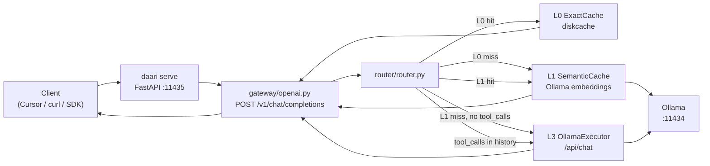

# daari — Architecture & project structure

> Living overview of the repo layout, runtime flow, and implementation status.  
> **Last updated:** 2026-07-23 (v1.2.0) · **Verified at:** `working tree`

For phase tasks and exit criteria, see [TRACKING.md](TRACKING.md). For clone/run/test pickup, see [DEVELOPING.md](DEVELOPING.md).

---

## What daari is

daari is an open-source **local execution router** — a cost optimizer you run on your machine. Dev agents (Cursor, OpenAI SDK, curl) send chat requests to a localhost daemon; daari routes each request through the cheapest capable tier (exact cache → local model) before any frontier API. It is **not a proxy**: routing, cache, and policy live in one Python process you own. See [PRD v0.4](prd/PRD.md) and [ADR-0013](adr/0013-monorepo-structure.md) for monorepo rules.

---

## Phase status

| Phase | Status | Summary |
|-------|--------|---------|
| **A / A.1 — Tracer bullet + install** | Done | gateway, L0, L3, router, metrics, evals; install, setup, doctor, L6 escalation, confidence |
| **B — Rules, Lt, multi-model** | Done | L1, L2, L2-dev, CCS, Lt B.0 + PolicyEngine, L4, setup recipes, ask/confirm UX, evals GP-20 |
| **C1/C2/C3 — Clients & providers** | Done | Anthropic gateway (+ tool passthrough), MCP ingress, Ollama-compatible facade, browser extension, web UI, MLX backend, Sourcegraph/GHE/GitLab providers, per-project `.daari.yaml` profiles, gateway API-key auth |
| **D — Local learning** | Done | feedback store + tuner (D1), example capture + MLX fine-tune (D2), opt-in collective stats export (D3), `learn deploy` |
| **Trust trains 1–5** | Done | cache-trust measurement (false-hit rate, diversity, normalization), prompt-cache passthrough + compaction + compression, latency-aware routing, learned routing, budgets/client attribution/PII scrub |
| **E2/E3 — Org shared cache + learning** | Done (tracer) | `daari org-cache serve`, `L0-org`/`L1-org` lookup + write-through, metadata feedback + profile sync |
| **Roadmap v2 (F1–F5)** | Next | OSS launch pack, gateway parity, Prometheus/OTel, enterprise scale-out — [ROADMAP-v2](prd/ROADMAP-v2.md) |

Detail and task checklists: [TRACKING.md](TRACKING.md).

---

## Directory tree

Concise layout as of `main` (~`3c44a8e`). Omitted: `__pycache__`, `.venv`, dotfiles.

```
daari/                              # repo root
├── daari/                          # Python package — routing brain (pip install -e .)
│   ├── cli/                        # Typer commands (serve, stats, report, trace, learn, setup, …)
│   ├── server/                     # FastAPI app factory + API-key middleware
│   ├── gateway/                    # OpenAI, Anthropic (tool passthrough), MCP, Ollama facade, PII scrub, request log
│   ├── router/                     # Tier routing + prompt profile, latency budgets, compression, MLX executor, model profiling
│   ├── cache/                      # L0 exact + L1 semantic (normalization, TTLs) + CCS command context
│   ├── learning/                   # Phase D: feedback, tuner, examples, dataset, finetune, deploy, collective, router model
│   ├── config/                     # Settings + defaults.yaml + per-project .daari.yaml profiles
│   ├── observability/              # Tier metrics, usage ledger (savings), request traces
│   ├── providers/                  # IntegrationProvider registry (Sourcegraph, GHE, GitLab)
│   ├── enterprise/                 # Org config + shared-cache/learning service and client
│   ├── rules/                      # L2 + L2-dev regex/template routing rules
│   ├── tools/                      # Lt subprocess executor
│   ├── policy/                     # Lt allow/deny/ask policy engine
│   ├── clients/                    # One-click setup recipes (Cursor, Claude Code, IntelliJ, VS Code)
│   └── setup/                      # doctor, wizard, backup, jsonc, models, openai-compat/context helpers
├── tests/
│   ├── unit/                       # cache, router, learning, trust, budgets, settings, …
│   ├── integration/                # gateway flows (OpenAI/Anthropic/MCP/facade/auth); optional live Ollama
│   ├── benchmark/                  # L0 vs L3 latency (optional)
│   └── test_*.py                   # routing evals, setup, doctor
├── evals/routing/                  # Golden prompts GP-01–GP-20
├── docs/                           # PRDs, ADRs, setup guides, release notes, tracker
├── scripts/                        # install.sh, demo.sh, bench.sh, tunnel.sh, autodev-local.sh
├── packages/
│   ├── browser-extension/          # MV3 popup → local daemon (jsdom-tested)
│   └── web-ui/                     # Stats/savings/traces dashboard (jsdom-tested)
├── pyproject.toml
├── README.md
└── CONTEXT.md                      # Agent handoff
```

User runtime paths (not in repo): `~/.daari/config.yaml`, `~/.daari/cache/{l0,l1}`, `~/.daari/traces/`, `~/.daari/usage/`, `~/.daari/feedback/`, `~/.daari/training/`, `~/.daari/backups/<tool>/`, `~/.daari/cursor-requests.log` (rotated).

---

## Path → purpose → status

### Runtime code (`daari/`)

| Path | Purpose | Status |
|------|---------|--------|
| `daari/__main__.py` | `python -m daari` entry | ✅ |
| `daari/cli/app.py` | Typer CLI: `serve`, `stats`, `doctor`, `setup` | ✅ |
| `daari/cli/setup_actions.py` | Shared setup apply helpers | ✅ |
| `daari/server/app.py` | FastAPI factory, lifespan → `AppContext` | ✅ |
| `daari/gateway/openai.py` | `POST /v1/chat/completions`, stats, health | ✅ |
| `daari/gateway/internal.py` | `InternalRequest` / `InternalResponse` / `DaariMeta` | ✅ |
| `daari/router/router.py` | Router: L0/CCS/L1/L2/Lt/L3/L4/L5/L6 + no-frontier + fallback behavior | ✅ |
| `daari/gateway/base.py` | `GatewayAdapter` protocol | ✅ |
| `daari/gateway/anthropic.py` | `POST /v1/messages` Anthropic-compatible adapter (minimal) | ✅ |
| `daari/gateway/mcp.py` | MCP ingress (`health`/`stats`/`route`, `tools/list`, `tools/call`) | ✅ expanded |
| `daari/cache/exact.py` | L0 exact cache keys + diskcache store | ✅ |
| `daari/cache/semantic.py` | L1 semantic cache — Ollama embeddings + cosine similarity | ✅ |
| `daari/config/settings.py` | Merged config (`defaults.yaml` + `~/.daari/` + profile overlays + skills prefix) | ✅ |
| `daari/config/defaults.yaml` | Package defaults (host, port, models) | ✅ |
| `daari/observability/metrics.py` | Tier counters for `/v1/daari/stats` | ✅ |
| `daari/providers/base.py` | `IntegrationProvider` protocol (`execute`, `health`) | ✅ |
| `daari/providers/registry.py` | Provider registry used by router | ✅ |
| `daari/providers/integrations.py` | Sourcegraph GraphQL + GHE repo/issue search providers | ✅ |
| `daari/enterprise/config.py` | Enterprise org settings schema (`OrgSettings`) including shared-cache URL/token fields | ✅ |
| `daari/enterprise/client.py` | Org shared-cache + learning HTTP clients used by router/CLI (`L0-org`, `L1-org`, feedback/profile) | ✅ |
| `daari/enterprise/service.py` | Lightweight shared-cache + learning FastAPI service (`/v1/org-cache/*`, `/v1/org-learning/*`) | ✅ |
| `daari/rules/engine.py` | L2 deterministic transforms (JSON/YAML) | ✅ |
| `daari/rules/dev_commands.py` | L2-dev developer command detection | ✅ |
| `daari/cache/command_context.py` | CCS store for command output reuse | ✅ |
| `daari/tools/shell.py` | Lt shell execution backend | ✅ |
| `daari/policy/engine.py` | Allow/deny/ask execution policy | ✅ |
| `daari/clients/base.py` | `ClientSetupRecipe` protocol | ✅ |
| `daari/clients/registry.py` | Setup recipe dispatch (`cursor`, `intellij`, `vscode`, `claude-code`) | ✅ |
| `daari/clients/cursor/recipe.py` | Cursor settings patch / undo / dry-run | ✅ |
| `daari/clients/intellij/recipe.py` | IntelliJ helper config patch / undo / dry-run | ✅ minimal |
| `daari/clients/vscode/recipe.py` | VS Code settings patch / undo / dry-run | ✅ minimal |
| `daari/clients/claude_code/recipe.py` | claude-code env helper + config pointer dry-run/apply/undo | ✅ minimal |
| `daari/setup/doctor.py` | Health checks (Python, config, Ollama models including embedding model, org cache, daemon) | ✅ |
| `daari/setup/wizard.py` | Interactive `daari setup` | ✅ |
| `daari/setup/backup.py` | Backup / restore for setup recipes | ✅ |
| `daari/setup/jsonc.py` | JSONC read/write for Cursor config | ✅ |
| `daari/setup/models.py` | `daari setup models` — tier → Ollama model | ✅ |
| `daari/setup/openai_compat.py` | `setup openai-compat` + frontier env/profile hints | ✅ |
| `daari/setup/context.py` | `daari context clear` cache invalidation helper + daemon cache-handle reload support | ✅ |
| `daari/gateway/ollama_compat.py` | Ollama-compatible facade (`/api/tags`, `/api/chat`, …) for JetBrains & Ollama-speaking clients | ✅ |
| `daari/gateway/pii.py` | Regex PII scrub before L6 escalation (opt-in) | ✅ |
| `daari/gateway/request_log.py` | Rotating JSON request log (`~/.daari/cursor-requests.log`) | ✅ |
| `daari/router/profile.py` | Prompt profiling: category, complexity, token estimate | ✅ |
| `daari/router/mlx_executor.py` | MLX backend executor (`mlx_lm.server`, Apple Silicon) | ✅ |
| `daari/router/model_profile.py` | `daari profile` benchmarks + warm-model tracking + latency budgets | ✅ |
| `daari/router/compress.py` | Frontier context compression (relevance pruning) | ✅ |
| `daari/cache/normalize.py` | Input normalization before L1 embedding | ✅ |
| `daari/observability/usage.py` | SQLite usage ledger — savings, budgets, client attribution | ✅ |
| `daari/observability/trace.py` | Per-request trace store (`daari trace`) | ✅ |
| `daari/learning/feedback.py` | Outcome store + explicit accept/reject + shadow-sampling stats | ✅ |
| `daari/learning/tuner.py` | Per-category confidence threshold tuner (opt-in) | ✅ |
| `daari/learning/examples.py` · `dataset.py` · `finetune.py` · `deploy.py` | Opt-in example capture → MLX LoRA fine-tune → adapter deploy | ✅ |
| `daari/learning/router_model.py` | Learned category/tier classifier (`daari learn train-router`) | ✅ |
| `daari/learning/collective.py` | D3 opt-in anonymized stats export (review-first) | ✅ |
| `daari/config/project.py` | Per-project `.daari.yaml` profiles (`X-Daari-Project`) | ✅ |

**Not in tree (Roadmap v2):** Docker/Helm artifacts, Prometheus exporter, Redis/Postgres backends, virtual keys, guardrails, Responses API adapter.

### Docs (`docs/`)

| Path | Purpose | Status |
|------|---------|--------|
| `docs/prd/` | PRD, ROADMAP, routing-spec, setup-spec, glossary | Spec (living) |
| `docs/adr/` | Architecture decision records 0001–0014 | Accepted |
| `docs/plans/phase-a.md` | Phase A implementation plan | Historical + reference |
| `docs/setup/cursor.md` | Manual Cursor fallback | ✅ |
| `docs/setup/intellij.md` | IntelliJ setup + helper config behavior | ✅ |
| `docs/setup/vscode.md` | VS Code setup helper behavior | ✅ |
| `docs/setup/claude-code.md` | claude-code env helper setup | ✅ |
| `docs/DEVELOPING.md` | Clone, run, test pickup | ✅ |
| `docs/TRACKING.md` | Phase task tracker | ✅ |
| `docs/ARCHITECTURE.md` | This file | ✅ |

### Scripts & tests

| Path | Purpose | Status |
|------|---------|--------|
| `scripts/install.sh` | venv + editable install + Ollama pull hint | ✅ |
| `scripts/demo.sh` | One-click smoke: serve, curl, stats, setup dry-run | ✅ |
| `tests/unit/` | Fast unit tests (CI) | ✅ |
| `tests/integration/` | Mocked gateway flow; live Ollama optional | ✅ |
| `tests/benchmark/` | Tier latency (`@pytest.mark.benchmark`) | ✅ optional |
| `tests/test_routing_eval.py` | GP-01–GP-20 routing evals | ✅ |
| `tests/test_setup.py`, `tests/test_doctor.py` | Setup / doctor coverage | ✅ |
| `.github/workflows/ci.yml` | Python 3.12 pytest on push/PR | ✅ |

### Other

| Path | Purpose | Status |
|------|---------|--------|
| `evals/routing/prompts.jsonl` | Golden prompt fixtures for routing evals | ✅ |
| `packages/README.md` | Placeholder for future browser ext / web UI | ✅ |
| `packages/browser-extension/` | Browser extension popup bridge + options page for daemon URL (`:11435` default) | ✅ |
| `packages/web-ui/README.md` | Web UI runtime docs (table + chart + auto-refresh controls) | ✅ |
| `CONTEXT.md` | Agent/session handoff | ✅ |

---

## Request flow

Typical chat completion path: client → OpenAI-compat gateway → router → cache/rules/tools/local models/frontier.



**Routing rules (shipped):**

1. Agent flows (`tools` present or `tool_calls` in history) skip caches, keep the full tool protocol, and route to local model tiers (ADR-0004).
2. Try L0 exact cache, then org L0 when configured (unless `X-Daari-No-Cache: true` or the category policy skips cache).
3. Try CCS for matched dev command context before re-execution.
4. Try L1 semantic cache (normalized-input embeddings + cosine threshold, per-category TTLs); near-misses above the draft threshold inject the cached answer as a draft; a sample of hits is shadow-checked to measure false-hit rate.
5. Apply L2-dev command rules (`git`, `pytest`, `eslint`) and policy gate; execute Lt when allowed.
6. Apply L2 deterministic transforms (JSON/YAML patterns).
7. Build the prompt profile (category/complexity; learned router can override the heuristic); pick the initial tier via category policy → tier cap (`X-Daari-Tier-Cap`, `.daari.yaml`) → latency budget step-down (profiled model latency vs `routing.latency_budget_ms` / `X-Daari-Latency-Budget`) with warm-model preference.
8. Model path L3/L4/L5 with fallback; confidence (per-category tuned when `learning.auto_tune`) drives escalation toward L6 — slimmed, optionally compressed and PII-scrubbed, budget-guarded (daily + monthly soft/hard).
9. `X-Daari-No-Frontier: true` (or the project profile) prevents L6 escalation.

---

## Entry points

### CLI (`daari`)

| Command | Purpose |
|---------|---------|
| `daari serve [--host] [--port] [--no-frontier] [--org]` | Start HTTP daemon (default `127.0.0.1:11435`) |
| `daari org-cache serve [--org] [--port] [--require-token]` | Start org shared-cache + learning service (default `127.0.0.1:11436`) |
| `daari org-learning stats` | Show aggregated org learning metrics |
| `daari org-learning sync` | Force the running daemon to refresh org-learning routing profile |
| `daari org-learning export [-o FILE]` | Export anonymized org learning summary |
| `daari stats [--host] [--port]` | Fetch tier counters from running daemon |
| `daari doctor` | Check Python, config, Ollama, model, optional daemon |
| `daari install [--run-doctor/--no-run-doctor] [--pull-l4] [--pull-l5]` | Run install workflow via `scripts/install.sh` |
| `daari setup` | Interactive setup wizard |
| `daari setup --undo <tool>` | Restore latest backup (e.g. `cursor`) |
| `daari setup cursor [--dry-run] [--force]` | Patch Cursor to point at daari |
| `daari setup intellij [--dry-run] [--force]` | Write IntelliJ helper OpenAI-compatible config |
| `daari setup vscode [--dry-run] [--force]` | Patch VS Code settings with daari OpenAI-compatible marker |
| `daari setup claude-code [--dry-run] [--force]` | Write claude-code OPENAI_* env helper + config pointer |
| `daari setup all [--dry-run] [--force]` | Run setup recipes for all detected clients |
| `daari setup models [--tier] [--model] [--list]` | Map tier → Ollama model in user config |
| `daari setup openai-compat` | Print OPENAI_* exports + write `~/.daari/.env.example` |
| `daari setup frontier-key` | Optional shell/profile frontier key hint (no secret persistence) |
| `daari context clear [--l0/--l1/--ccs]` | Clear L0/L1/CCS caches and auto-refresh running daemon cache handles |
| `daari report [--days N] [--md FILE]` | Usage, savings, budget state, client breakdown, cache trust |
| `daari trace [ID] [--md FILE]` | Per-request decision timeline |
| `daari feedback <trace_id> --accept/--reject` | Explicit outcome feedback |
| `daari learn stats/recommend/examples/export-dataset/train-router/finetune/deploy/export-stats` | Phase D learning loop |
| `daari profile [--models ...]` | Benchmark local models (tokens/sec, load) for latency-aware routing |
| `daari project init/show` | Per-repo `.daari.yaml` profile management |
| `daari cache prune` | Remove expired L0/L1 entries |
| `daari web-ui serve` | Local dashboard (stats, savings, traces, cache trust) |
| `daari setup cursor --tunnel` | Cursor BYOK via cloudflared + auto-generated gateway API key |

Registered in `pyproject.toml` as `daari = "daari.cli.app:app"`.

### HTTP (daemon)

| Method | Path | Purpose |
|--------|------|---------|
| `POST` | `/v1/chat/completions` | OpenAI-compat chat with full SSE streaming (tier fallback, L0/L1, draft injection) |
| `GET` | `/v1/models`, `/v1/models/{id}` | Model listing for client pickers |
| `POST` | `/v1/messages` | Anthropic-compatible adapter with tool passthrough (non-stream + SSE) |
| `GET`/`POST` | `/api/tags`, `/api/chat`, `/api/version`, `/api/show`, `/api/ps` | Ollama-compatible facade (JetBrains AI Assistant, any Ollama client) |
| `POST` | `/v1/mcp/query` | MCP ingress (`health`, `stats`, `route`, `tools/list`, `tools/call`, providers) |
| `POST` | `/v1/daari/reload-caches` | Reload in-memory L0/L1/CCS handles from current settings |
| `GET` | `/v1/daari/stats` | Tier metrics snapshot |
| `GET` | `/v1/daari/report` | Usage/savings/budget/cache-trust report |
| `GET` | `/v1/daari/traces`, `/v1/daari/traces/{id}` | Request trace list/detail |
| `POST` | `/v1/daari/feedback` | Explicit accept/reject by trace_id |
| `GET` | `/v1/daari/learn/stats` | Learning outcome evidence |
| `GET` | `/v1/daari/cache/diversity` | Semantic-cache diversity stats |
| `GET` | `/health` | Liveness (open even when API-key auth is on) |

When `server.api_key` is set (auto-generated by `daari setup cursor --tunnel`), all non-health endpoints require `Authorization: Bearer` or `x-api-key`.

Optional headers on chat: `X-Daari-No-Cache`, `X-Daari-Tier-Override`, `X-Daari-Tier-Cap`, `X-Daari-No-Frontier`, `X-Daari-Latency-Budget`, `X-Daari-Client-Id`, `X-Daari-Project`, `X-Daari-Meta`, `X-Daari-Tools`, `X-Daari-Confirm`, `X-Daari-Confirm-Tool`, `X-Daari-ReRun-Command`.

Org shared-cache service (`daari org-cache serve`):

| Method | Path | Purpose |
|--------|------|---------|
| `GET` | `/v1/org-cache/get?key=...&tier=...` | Read org cache entry |
| `PUT` | `/v1/org-cache/put` | Write org cache entry |
| `GET` | `/v1/org-cache/stats` | Show entries and hit/miss/write counters |

Org learning endpoints (same service host):

| Method | Path | Purpose |
|--------|------|---------|
| `POST` | `/v1/org-learning/feedback` | Ingest anonymized routing feedback metadata |
| `GET` | `/v1/org-learning/profile` | Read aggregated org routing profile |
| `PUT` | `/v1/org-learning/profile` | Admin override for org routing profile (token-gated) |
| `POST` | `/v1/org-learning/sync` | Force profile refresh in running daemon app context |

### Scripts

| Script | Purpose |
|--------|---------|
| `./scripts/install.sh` | Create venv, `pip install -e ".[dev]"`, Ollama model hint |
| `./scripts/demo.sh` | Full smoke: install, serve, double curl (L0 hit), stats, setup dry-run |
| `./scripts/bench.sh` | Tier latency benchmark helper (L0/L1/L2/Lt/L3) with robust uncached prompt seeding |
| `./scripts/smoke-cursor-dry-run.sh` | CI-friendly `daari setup cursor --dry-run` smoke command |

---

## Implemented vs spec-only

| Area | Implemented | Spec only / deferred (Roadmap v2) |
|------|-------------|------------------------|
| Gateway | OpenAI (+SSE), Anthropic with tool passthrough, MCP ingress, Ollama facade, API-key auth, PII scrub | Responses API, guardrails, virtual keys, MCP egress client |
| Tiers | L0/L1 (TTLs, normalization, draft injection, shadow sampling), CCS, L2/L2-dev, Lt + policy, L3–L5 (Ollama or MLX), L6 with slimming/compression/budgets | multi-provider L6 fallback chains, key rotation, circuit breakers |
| Routing intelligence | Prompt profile, category policies, tier caps, latency budgets + model profiling + warm preference, learned router, tuner | capability catalog, VRAM stack advisor |
| Learning | Feedback → stats/recommend → tuner → examples → fine-tune → deploy; D3 opt-in export | D4 published defaults pipeline |
| Setup | One-click Cursor (tunnel+auth), Claude Code, IntelliJ facade, VS Code, openai-compat, per-project profiles | Homebrew, Docker one-command |
| Providers | Sourcegraph, GHE, GitLab, generic HTTP, L2-live URL fetch | live-source family (Open-Meteo, wttr.in, `sources.yaml`) |
| Observability | Tier metrics, usage ledger + savings, traces, request log rotation, web dashboard, MD export | Prometheus `/metrics`, Grafana, OTel |
| Enterprise | Org shared cache + learning sync (tracer), API-key auth | Redis/Postgres backends, stateless replicas, Helm, fleet bootstrap, SSO/RBAC/audit |
| Packages | browser-extension + web-ui (both jsdom-tested in CI) | intellij-plugin (superseded by Ollama facade) |

Source of truth for “done”: [TRACKING.md](TRACKING.md) task tables + `daari/` tree + pytest.

---

## Suggested walkthrough order

Read in this order to follow a request from CLI to response, then setup and tests.

1. `README.md` — one-paragraph product + quick start  
2. `docs/prd/PRD.md` (§ tiers) or [routing-spec](prd/routing-spec.md) — tier model  
3. `daari/config/defaults.yaml` → `daari/config/settings.py` — config merge  
4. `daari/gateway/internal.py` — internal wire models  
5. `daari/server/app.py` — app bootstrap  
6. `daari/gateway/openai.py` — HTTP → internal request  
7. `daari/router/router.py` — L0 / L1 / L3 routing  
8. `daari/cache/exact.py` — L0 cache keys  
9. `daari/cache/semantic.py` — L1 semantic cache  
10. `daari/observability/metrics.py` — stats  
11. `daari/cli/app.py` — CLI surface  
12. `daari/clients/cursor/recipe.py` + `daari/setup/` — Phase A.1 setup  
13. `tests/integration/test_gateway_flow.py` — end-to-end mocked flow  
14. `tests/test_routing_eval.py` + `evals/routing/prompts.jsonl` — routing quality  
15. `docs/adr/0013-monorepo-structure.md` — where future code goes  

---

## Maintenance

**Update this doc when:**

- A new **phase ships** (or exits) — refresh phase status, path table, implemented vs spec
- A **major module** is added under `daari/` (e.g. `tools/`, new gateway adapter)
- A **tier is implemented** (L1, L2, L6, Lt, …) — update flow diagram and routing rules
- A **CLI command** or **HTTP endpoint** is added or renamed
- Default **ports, paths, or entry points** change

Also refresh **Last updated** and **Verified at** commit when editing. Keep [TRACKING.md](TRACKING.md) as the task-level checklist; this file is the structural map.
