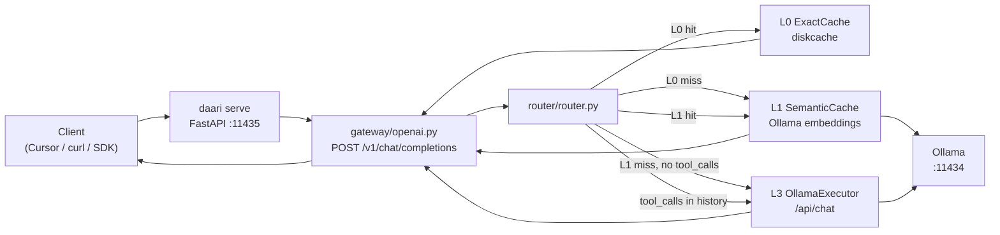

# daari — Architecture & project structure

> Living overview of the repo layout, runtime flow, and implementation status.  
> **Last updated:** 2026-06-21 · **Verified at:** `working tree`

For phase tasks and exit criteria, see [TRACKING.md](TRACKING.md). For clone/run/test pickup, see [DEVELOPING.md](DEVELOPING.md).

---

## What daari is

daari is an open-source **local execution router** — a cost optimizer you run on your machine. Dev agents (Cursor, OpenAI SDK, curl) send chat requests to a localhost daemon; daari routes each request through the cheapest capable tier (exact cache → local model) before any frontier API. It is **not a proxy**: routing, cache, and policy live in one Python process you own. See [PRD v0.4](prd/PRD.md) and [ADR-0013](adr/0013-monorepo-structure.md) for monorepo rules.

---

## Phase status

| Phase | Status | Summary |
|-------|--------|---------|
| **A — Tracer bullet** | Done | `daari serve`, OpenAI gateway, L0 cache, L3 Ollama, router, metrics, routing evals GP-01–GP-10 |
| **A.1 — Install & setup** | Mostly done | L6 frontier escalation shipped; `daari install` CLI added; wizard now includes frontier key helper hints |
| **B — Rules, Lt, …** | In progress | L1, L2, L2-dev, CCS, Lt B.0, PolicyEngine B.0, L4 routing shipped; `setup openai-compat` and `context clear` added |
| **C — Bootstrap slice** | In progress | gateway adapter protocol, Anthropic adapter (+stream fallback), MCP tool schemas, integration provider depth, profile/skills loader stubs |
| **E2 — Org shared cache (MVP)** | Done | `daari org-cache serve`, org cache client, router `L0-org`/`L1-org` lookup + write-through |
| **E3 — Org collective learning (MVP)** | Done | metadata feedback ingestion, org routing profile aggregation, startup profile merge |

Detail and task checklists: [TRACKING.md](TRACKING.md).

---

## Directory tree

Concise layout as of `main` (~`3c44a8e`). Omitted: `__pycache__`, `.venv`, dotfiles.

```
daari/                              # repo root
├── daari/                          # Python package — routing brain (pip install -e .)
│   ├── cli/                        # Typer commands (serve, stats, doctor, setup)
│   ├── server/                     # FastAPI app factory
│   ├── gateway/                    # Wire adapters + internal request/response models
│   ├── router/                     # Tier routing (L0 → CCS → L1 → L2-dev → L2 → Lt → L3/L4 → L6)
│   ├── cache/                      # L0 exact + L1 semantic + CCS command context
│   ├── config/                     # Settings + defaults.yaml
│   ├── observability/              # In-process tier metrics
│   ├── providers/                  # IntegrationProvider registry (wired for model tiers)
│   ├── enterprise/                 # Enterprise config + org shared-cache service/client
│   ├── rules/                      # L2 + L2-dev regex/template routing rules
│   ├── tools/                      # Lt subprocess executor
│   ├── policy/                     # Lt allow/deny/ask policy engine
│   ├── clients/                    # Setup recipes (Cursor)
│   └── setup/                      # doctor, wizard, backup, jsonc, models, openai-compat/context helpers
├── tests/
│   ├── unit/                       # cache, metrics, settings, internal models
│   ├── integration/                # gateway flow; optional live Ollama
│   ├── benchmark/                  # L0 vs L3 latency (optional)
│   └── test_*.py                   # phase A evals, setup, doctor
├── evals/routing/                  # Golden prompts GP-01–GP-20
├── docs/                           # PRD, ADRs, plans, setup guides
├── scripts/                        # install.sh, demo.sh
├── packages/                       # Placeholder for future TS/Kotlin surfaces
├── pyproject.toml
├── README.md
└── CONTEXT.md                      # Agent handoff
```

User runtime paths (not in repo): `~/.daari/config.yaml`, `~/.daari/cache/l0`, `~/.daari/cache/l1`, `~/.daari/backups/<tool>/`.

---

## Path → purpose → status

### Runtime code (`daari/`)

| Path | Purpose | Status |
|------|---------|--------|
| `daari/__main__.py` | `python -m daari` entry | ✅ |
| `daari/cli/app.py` | Typer CLI: `serve`, `stats`, `doctor`, `setup` | ✅ |
| `daari/cli/setup_actions.py` | Shared setup apply helpers | ✅ |
| `daari/server/app.py` | FastAPI factory, lifespan → `AppContext` | ✅ |
| `daari/gateway/openai.py` | `POST /v1/chat/completions`, stats, health | ✅ |
| `daari/gateway/internal.py` | `InternalRequest` / `InternalResponse` / `DaariMeta` | ✅ |
| `daari/router/router.py` | Router: L0/CCS/L1/L2/Lt/L3/L4/L5/L6 + no-frontier + fallback behavior | ✅ |
| `daari/gateway/base.py` | `GatewayAdapter` protocol | ✅ |
| `daari/gateway/anthropic.py` | `POST /v1/messages` Anthropic-compatible adapter (minimal) | ✅ |
| `daari/gateway/mcp.py` | MCP ingress (`health`/`stats`/`route`, `tools/list`, `tools/call`) | ✅ expanded |
| `daari/cache/exact.py` | L0 exact cache keys + diskcache store | ✅ |
| `daari/cache/semantic.py` | L1 semantic cache — Ollama embeddings + cosine similarity | ✅ |
| `daari/config/settings.py` | Merged config (`defaults.yaml` + `~/.daari/` + profile overlays + skills prefix) | ✅ |
| `daari/config/defaults.yaml` | Package defaults (host, port, models) | ✅ |
| `daari/observability/metrics.py` | Tier counters for `/v1/daari/stats` | ✅ |
| `daari/providers/base.py` | `IntegrationProvider` protocol (`execute`, `health`) | ✅ |
| `daari/providers/registry.py` | Provider registry used by router | ✅ |
| `daari/providers/integrations.py` | Sourcegraph GraphQL + GHE repo/issue search providers | ✅ |
| `daari/enterprise/config.py` | Enterprise org settings schema (`OrgSettings`) including shared-cache URL/token fields | ✅ |
| `daari/enterprise/client.py` | Org shared-cache + learning HTTP clients used by router/CLI (`L0-org`, `L1-org`, feedback/profile) | ✅ |
| `daari/enterprise/service.py` | Lightweight shared-cache + learning FastAPI service (`/v1/org-cache/*`, `/v1/org-learning/*`) | ✅ |
| `daari/rules/engine.py` | L2 deterministic transforms (JSON/YAML) | ✅ |
| `daari/rules/dev_commands.py` | L2-dev developer command detection | ✅ |
| `daari/cache/command_context.py` | CCS store for command output reuse | ✅ |
| `daari/tools/shell.py` | Lt shell execution backend | ✅ |
| `daari/policy/engine.py` | Allow/deny/ask execution policy | ✅ |
| `daari/clients/base.py` | `ClientSetupRecipe` protocol | ✅ |
| `daari/clients/registry.py` | Setup recipe dispatch (`cursor`, `intellij`, `vscode`, `claude-code`) | ✅ |
| `daari/clients/cursor/recipe.py` | Cursor settings patch / undo / dry-run | ✅ |
| `daari/clients/intellij/recipe.py` | IntelliJ helper config patch / undo / dry-run | ✅ minimal |
| `daari/clients/vscode/recipe.py` | VS Code settings patch / undo / dry-run | ✅ minimal |
| `daari/clients/claude_code/recipe.py` | claude-code env helper + config pointer dry-run/apply/undo | ✅ minimal |
| `daari/setup/doctor.py` | Health checks (Python, config, Ollama, org cache, daemon) | ✅ |
| `daari/setup/wizard.py` | Interactive `daari setup` | ✅ |
| `daari/setup/backup.py` | Backup / restore for setup recipes | ✅ |
| `daari/setup/jsonc.py` | JSONC read/write for Cursor config | ✅ |
| `daari/setup/models.py` | `daari setup models` — tier → Ollama model | ✅ |
| `daari/setup/openai_compat.py` | `setup openai-compat` + frontier env/profile hints | ✅ |
| `daari/setup/context.py` | `daari context clear` cache invalidation helper | ✅ |

**Not in tree (spec / later phases):** IntelliJ plugin backend, enterprise runtime providers.

### Docs (`docs/`)

| Path | Purpose | Status |
|------|---------|--------|
| `docs/prd/` | PRD, ROADMAP, routing-spec, setup-spec, glossary | Spec (living) |
| `docs/adr/` | Architecture decision records 0001–0014 | Accepted |
| `docs/plans/phase-a.md` | Phase A implementation plan | Historical + reference |
| `docs/setup/cursor.md` | Manual Cursor fallback | ✅ |
| `docs/setup/intellij.md` | IntelliJ setup + helper config behavior | ✅ |
| `docs/setup/vscode.md` | VS Code setup helper behavior | ✅ |
| `docs/setup/claude-code.md` | claude-code env helper setup | ✅ |
| `docs/DEVELOPING.md` | Clone, run, test pickup | ✅ |
| `docs/TRACKING.md` | Phase task tracker | ✅ |
| `docs/ARCHITECTURE.md` | This file | ✅ |

### Scripts & tests

| Path | Purpose | Status |
|------|---------|--------|
| `scripts/install.sh` | venv + editable install + Ollama pull hint | ✅ |
| `scripts/demo.sh` | One-click smoke: serve, curl, stats, setup dry-run | ✅ |
| `tests/unit/` | Fast unit tests (CI) | ✅ |
| `tests/integration/` | Mocked gateway flow; live Ollama optional | ✅ |
| `tests/benchmark/` | Tier latency (`@pytest.mark.benchmark`) | ✅ optional |
| `tests/test_routing_eval.py` | GP-01–GP-20 routing evals | ✅ |
| `tests/test_setup.py`, `tests/test_doctor.py` | Setup / doctor coverage | ✅ |
| `.github/workflows/ci.yml` | Python 3.12 pytest on push/PR | ✅ |

### Other

| Path | Purpose | Status |
|------|---------|--------|
| `evals/routing/prompts.jsonl` | Golden prompt fixtures for routing evals | ✅ |
| `packages/README.md` | Placeholder for future browser ext / web UI | ✅ |
| `packages/browser-extension/` | Browser extension scaffold with MV3 placeholder manifest | ✅ scaffold |
| `packages/web-ui/README.md` | Minimal web UI scaffold placeholder | ✅ scaffold |
| `CONTEXT.md` | Agent/session handoff | ✅ |

---

## Request flow

Typical chat completion path: client → OpenAI-compat gateway → router → cache/rules/tools/local models/frontier.



**Routing rules (shipped):**

1. Messages with `tool_calls` in history skip caches and route directly to local model tier.
2. Try L0 exact cache (unless `X-Daari-No-Cache: true`).
3. Try CCS for matched dev command context before re-execution.
4. Try L1 semantic cache (Ollama embeddings + cosine threshold).
5. Apply L2-dev command rules (`git`, `pytest`, `eslint`) and policy gate; execute Lt when allowed.
6. Apply L2 deterministic transforms (JSON/YAML patterns).
7. Model path: L3/L4 (and optional L5 override/accuracy path), then confidence escalation toward L6.
8. `X-Daari-No-Frontier: true` prevents L6 escalation.

---

## Entry points

### CLI (`daari`)

| Command | Purpose |
|---------|---------|
| `daari serve [--host] [--port] [--no-frontier] [--org]` | Start HTTP daemon (default `127.0.0.1:11435`) |
| `daari org-cache serve [--org] [--port] [--require-token]` | Start org shared-cache + learning service (default `127.0.0.1:11436`) |
| `daari org-learning stats` | Show aggregated org learning metrics |
| `daari org-learning export [-o FILE]` | Export anonymized org learning summary |
| `daari stats [--host] [--port]` | Fetch tier counters from running daemon |
| `daari doctor` | Check Python, config, Ollama, model, optional daemon |
| `daari install [--run-doctor/--no-run-doctor] [--pull-l4] [--pull-l5]` | Run install workflow via `scripts/install.sh` |
| `daari setup` | Interactive setup wizard |
| `daari setup --undo <tool>` | Restore latest backup (e.g. `cursor`) |
| `daari setup cursor [--dry-run] [--force]` | Patch Cursor to point at daari |
| `daari setup intellij [--dry-run] [--force]` | Write IntelliJ helper OpenAI-compatible config |
| `daari setup vscode [--dry-run] [--force]` | Patch VS Code settings with daari OpenAI-compatible marker |
| `daari setup claude-code [--dry-run] [--force]` | Write claude-code OPENAI_* env helper + config pointer |
| `daari setup all [--dry-run] [--force]` | Run setup recipes for all detected clients |
| `daari setup models [--tier] [--model] [--list]` | Map tier → Ollama model in user config |
| `daari setup openai-compat` | Print OPENAI_* exports + write `~/.daari/.env.example` |
| `daari setup frontier-key` | Optional shell/profile frontier key hint (no secret persistence) |
| `daari context clear [--l0/--l1/--ccs]` | Clear L0/L1/CCS caches |

Registered in `pyproject.toml` as `daari = "daari.cli.app:app"`.

### HTTP (daemon)

| Method | Path | Purpose |
|--------|------|---------|
| `POST` | `/v1/chat/completions` | OpenAI-compat chat (supports basic SSE streaming passthrough) |
| `POST` | `/v1/messages` | Anthropic-compatible messages adapter (non-stream + SSE `stream: true`) |
| `POST` | `/v1/mcp/query` | MCP ingress endpoint (`health`, `stats`, `route`, `sourcegraph`, `ghe`, `tools/list`, `tools/call`) |
| `GET` | `/v1/daari/stats` | Tier metrics snapshot |
| `GET` | `/health` | Liveness |

Optional headers on chat: `X-Daari-No-Cache`, `X-Daari-Tier-Override`, `X-Daari-No-Frontier`, `X-Daari-Confirm`, `X-Daari-Confirm-Tool`, `X-Daari-ReRun-Command`.

Org shared-cache service (`daari org-cache serve`):

| Method | Path | Purpose |
|--------|------|---------|
| `GET` | `/v1/org-cache/get?key=...&tier=...` | Read org cache entry |
| `PUT` | `/v1/org-cache/put` | Write org cache entry |
| `GET` | `/v1/org-cache/stats` | Show entries and hit/miss/write counters |

Org learning endpoints (same service host):

| Method | Path | Purpose |
|--------|------|---------|
| `POST` | `/v1/org-learning/feedback` | Ingest anonymized routing feedback metadata |
| `GET` | `/v1/org-learning/profile` | Read aggregated org routing profile |
| `PUT` | `/v1/org-learning/profile` | Admin override for org routing profile (token-gated) |

### Scripts

| Script | Purpose |
|--------|---------|
| `./scripts/install.sh` | Create venv, `pip install -e ".[dev]"`, Ollama model hint |
| `./scripts/demo.sh` | Full smoke: install, serve, double curl (L0 hit), stats, setup dry-run |
| `./scripts/bench.sh` | Tier latency benchmark helper (L0/L1/L2/Lt/L3) |

---

## Implemented vs spec-only

| Area | Implemented | Spec only / deferred |
|------|-------------|------------------------|
| Gateway | OpenAI + Anthropic adapters, Anthropic stream fallback, MCP typed ingress + tool schemas | deeper MCP auth/session semantics |
| Tiers | L0 exact, CCS, L1 semantic, L2 rules, L2-dev, Lt, L3, L4, L5 wiring, L6 | L5 model auto-provision and tuning |
| Router | Full Phase B.0 pipeline + policy + no-frontier behavior + ask/confirm metadata + minimal L2-live fetch | broader B.1 command profiles |
| Setup | Cursor + IntelliJ + VS Code + claude-code recipes, wizard polish, models preference, install wrapper, openai-compat helper, frontier key hint, context clear | deeper IDE-native integrations |
| Providers | Registry + model providers + Sourcegraph GraphQL/GHE REST integration calls | GitLab provider and richer corp plugin surfaces |
| Observability | In-process tier counters | External dashboards, web UI (`packages/web-ui`) |
| Enterprise | ADR-0014 + org shared-cache + org learning feedback/profile sync | periodic profile refresh and advanced E4+ controls |
| Packages | README + browser-extension scaffold | web-ui, intellij-plugin, extension runtime code |

Source of truth for “done”: [TRACKING.md](TRACKING.md) task tables + `daari/` tree + pytest.

---

## Suggested walkthrough order

Read in this order to follow a request from CLI to response, then setup and tests.

1. `README.md` — one-paragraph product + quick start  
2. `docs/prd/PRD.md` (§ tiers) or [routing-spec](prd/routing-spec.md) — tier model  
3. `daari/config/defaults.yaml` → `daari/config/settings.py` — config merge  
4. `daari/gateway/internal.py` — internal wire models  
5. `daari/server/app.py` — app bootstrap  
6. `daari/gateway/openai.py` — HTTP → internal request  
7. `daari/router/router.py` — L0 / L1 / L3 routing  
8. `daari/cache/exact.py` — L0 cache keys  
9. `daari/cache/semantic.py` — L1 semantic cache  
10. `daari/observability/metrics.py` — stats  
11. `daari/cli/app.py` — CLI surface  
12. `daari/clients/cursor/recipe.py` + `daari/setup/` — Phase A.1 setup  
13. `tests/integration/test_gateway_flow.py` — end-to-end mocked flow  
14. `tests/test_routing_eval.py` + `evals/routing/prompts.jsonl` — routing quality  
15. `docs/adr/0013-monorepo-structure.md` — where future code goes  

---

## Maintenance

**Update this doc when:**

- A new **phase ships** (or exits) — refresh phase status, path table, implemented vs spec
- A **major module** is added under `daari/` (e.g. `tools/`, new gateway adapter)
- A **tier is implemented** (L1, L2, L6, Lt, …) — update flow diagram and routing rules
- A **CLI command** or **HTTP endpoint** is added or renamed
- Default **ports, paths, or entry points** change

Also refresh **Last updated** and **Verified at** commit when editing. Keep [TRACKING.md](TRACKING.md) as the task-level checklist; this file is the structural map.
