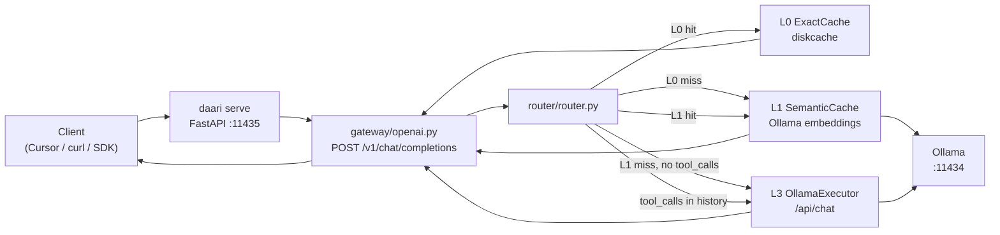

# daari — Architecture & project structure

> Living overview of the repo layout, runtime flow, and implementation status.  
> **Last updated:** 2026-06-20 · **Verified at:** `3c44a8e`

For phase tasks and exit criteria, see [TRACKING.md](TRACKING.md). For clone/run/test pickup, see [DEVELOPING.md](DEVELOPING.md).

---

## What daari is

daari is an open-source **local execution router** — a cost optimizer you run on your machine. Dev agents (Cursor, OpenAI SDK, curl) send chat requests to a localhost daemon; daari routes each request through the cheapest capable tier (exact cache → local model) before any frontier API. It is **not a proxy**: routing, cache, and policy live in one Python process you own. See [PRD v0.4](prd/PRD.md) and [ADR-0013](adr/0013-monorepo-structure.md) for monorepo rules.

---

## Phase status

| Phase | Status | Summary |
|-------|--------|---------|
| **A — Tracer bullet** | Done | `daari serve`, OpenAI gateway, L0 cache, L3 Ollama, router, metrics, routing evals GP-01–GP-10 |
| **A.1 — Install & setup** | Mostly done | L6 frontier escalation shipped; wizard partial vs spec; `daari install` Typer deferred; Cursor smoke test user-owned |
| **B — Rules, Lt, …** | In progress | L1 semantic cache shipped; L2 rules, Lt tool-native, PolicyEngine, L4/L5 — see [ROADMAP](prd/ROADMAP.md) |

Detail and task checklists: [TRACKING.md](TRACKING.md).

---

## Directory tree

Concise layout as of `main` (~`3c44a8e`). Omitted: `__pycache__`, `.venv`, dotfiles.

```
daari/                              # repo root
├── daari/                          # Python package — routing brain (pip install -e .)
│   ├── cli/                        # Typer commands (serve, stats, doctor, setup)
│   ├── server/                     # FastAPI app factory
│   ├── gateway/                    # Wire adapters + internal request/response models
│   ├── router/                     # Tier routing (L0 → L1 → L3 → L6)
│   ├── cache/                      # L0 exact + L1 semantic cache (diskcache)
│   ├── config/                     # Settings + defaults.yaml
│   ├── observability/              # In-process tier metrics
│   ├── providers/                  # IntegrationProvider registry (stub for Phase B+)
│   ├── clients/                    # Setup recipes (Cursor)
│   └── setup/                      # doctor, wizard, backup, jsonc, models
├── tests/
│   ├── unit/                       # cache, metrics, settings, internal models
│   ├── integration/                # gateway flow; optional live Ollama
│   ├── benchmark/                  # L0 vs L3 latency (optional)
│   └── test_*.py                   # phase A evals, setup, doctor
├── evals/routing/                  # Golden prompts GP-01–GP-10
├── docs/                           # PRD, ADRs, plans, setup guides
├── scripts/                        # install.sh, demo.sh
├── packages/                       # Placeholder for future TS/Kotlin surfaces
├── pyproject.toml
├── README.md
└── CONTEXT.md                      # Agent handoff
```

User runtime paths (not in repo): `~/.daari/config.yaml`, `~/.daari/cache/l0`, `~/.daari/cache/l1`, `~/.daari/backups/<tool>/`.

---

## Path → purpose → status

### Runtime code (`daari/`)

| Path | Purpose | Status |
|------|---------|--------|
| `daari/__main__.py` | `python -m daari` entry | ✅ |
| `daari/cli/app.py` | Typer CLI: `serve`, `stats`, `doctor`, `setup` | ✅ |
| `daari/cli/setup_actions.py` | Shared setup apply helpers | ✅ |
| `daari/server/app.py` | FastAPI factory, lifespan → `AppContext` | ✅ |
| `daari/gateway/openai.py` | `POST /v1/chat/completions`, stats, health | ✅ |
| `daari/gateway/internal.py` | `InternalRequest` / `InternalResponse` / `DaariMeta` | ✅ |
| `daari/router/router.py` | Router: L0 → L1 → L3 Ollama → L6; tool_calls skip caches | ✅ |
| `daari/cache/exact.py` | L0 exact cache keys + diskcache store | ✅ |
| `daari/cache/semantic.py` | L1 semantic cache — Ollama embeddings + cosine similarity | ✅ |
| `daari/config/settings.py` | Merged config (`defaults.yaml` + `~/.daari/`) | ✅ |
| `daari/config/defaults.yaml` | Package defaults (host, port, models) | ✅ |
| `daari/observability/metrics.py` | Tier counters for `/v1/daari/stats` | ✅ |
| `daari/providers/base.py` | `IntegrationProvider` protocol | Spec / stub |
| `daari/providers/registry.py` | Provider registry | Spec / stub |
| `daari/clients/base.py` | `ClientSetupRecipe` protocol | ✅ |
| `daari/clients/registry.py` | Setup recipe dispatch (`cursor` only) | ✅ |
| `daari/clients/cursor/recipe.py` | Cursor settings patch / undo / dry-run | ✅ |
| `daari/setup/doctor.py` | Health checks (Python, config, Ollama, daemon) | ✅ |
| `daari/setup/wizard.py` | Interactive `daari setup` | ✅ partial |
| `daari/setup/backup.py` | Backup / restore for setup recipes | ✅ |
| `daari/setup/jsonc.py` | JSONC read/write for Cursor config | ✅ |
| `daari/setup/models.py` | `daari setup models` — tier → Ollama model | ✅ |

**Not in tree (spec / Phase B+):** `gateway/anthropic.py`, `gateway/mcp.py`, `tools/backends/`, L2/L2-dev executors, PolicyEngine, Lt runtime.

### Docs (`docs/`)

| Path | Purpose | Status |
|------|---------|--------|
| `docs/prd/` | PRD, ROADMAP, routing-spec, setup-spec, glossary | Spec (living) |
| `docs/adr/` | Architecture decision records 0001–0014 | Accepted |
| `docs/plans/phase-a.md` | Phase A implementation plan | Historical + reference |
| `docs/setup/cursor.md` | Manual Cursor fallback | ✅ |
| `docs/DEVELOPING.md` | Clone, run, test pickup | ✅ |
| `docs/TRACKING.md` | Phase task tracker | ✅ |
| `docs/ARCHITECTURE.md` | This file | ✅ |

### Scripts & tests

| Path | Purpose | Status |
|------|---------|--------|
| `scripts/install.sh` | venv + editable install + Ollama pull hint | ✅ |
| `scripts/demo.sh` | One-click smoke: serve, curl, stats, setup dry-run | ✅ |
| `tests/unit/` | Fast unit tests (CI) | ✅ |
| `tests/integration/` | Mocked gateway flow; live Ollama optional | ✅ |
| `tests/benchmark/` | Tier latency (`@pytest.mark.benchmark`) | ✅ optional |
| `tests/test_routing_eval.py` | GP-01–GP-10 routing evals | ✅ |
| `tests/test_setup.py`, `tests/test_doctor.py` | Setup / doctor coverage | ✅ |
| `.github/workflows/ci.yml` | Python 3.12 pytest on push/PR | ✅ |

### Other

| Path | Purpose | Status |
|------|---------|--------|
| `evals/routing/prompts.jsonl` | Golden prompt fixtures for routing evals | ✅ |
| `packages/README.md` | Placeholder for future browser ext / web UI | Spec only |
| `CONTEXT.md` | Agent/session handoff | ✅ |

---

## Request flow

Typical chat completion path (Phase B tracer): client → OpenAI-compat gateway → router → L0, L1, or L3.



**Routing rules (shipped):**

1. Messages with `tool_calls` in history → skip L0 and L1, go straight to L3 (ADR-0004).
2. Otherwise try L0 (unless `X-Daari-No-Cache: true`).
3. L0 miss → L1 semantic lookup (Ollama `/api/embeddings`, cosine ≥ `cache.l1.similarity_threshold`).
4. L1 miss → L3 Ollama; confidence check on result.
5. If L3 confidence below `frontier.confidence_threshold` and frontier enabled with API key → L6 OpenAI-compatible API.
6. Otherwise return L3 (with `daari_meta.warning` when below threshold and L6 unavailable).
7. On L3 success (cacheable): write L0 exact + L1 semantic entries.
8. Ollama unreachable → HTTP 503; L1 embedding failure → graceful miss, fall through to L3.

**Not wired yet:** tier override header handling beyond passthrough meta, L4/L5 intermediate tiers, L2 rules, Lt tool-native path.

---

## Entry points

### CLI (`daari`)

| Command | Purpose |
|---------|---------|
| `daari serve [--host] [--port]` | Start HTTP daemon (default `127.0.0.1:11435`) |
| `daari stats [--host] [--port]` | Fetch tier counters from running daemon |
| `daari doctor` | Check Python, config, Ollama, model, optional daemon |
| `daari setup` | Interactive setup wizard |
| `daari setup --undo <tool>` | Restore latest backup (e.g. `cursor`) |
| `daari setup cursor [--dry-run] [--force]` | Patch Cursor to point at daari |
| `daari setup models [--tier] [--model] [--list]` | Map tier → Ollama model in user config |

Registered in `pyproject.toml` as `daari = "daari.cli.app:app"`. No `daari install` Typer command yet — use `./scripts/install.sh`.

### HTTP (daemon)

| Method | Path | Purpose |
|--------|------|---------|
| `POST` | `/v1/chat/completions` | OpenAI-compat chat (non-streaming) |
| `GET` | `/v1/daari/stats` | Tier metrics snapshot |
| `GET` | `/health` | Liveness |

Optional headers on chat: `X-Daari-No-Cache`, `X-Daari-Tier-Override` (override not fully implemented).

### Scripts

| Script | Purpose |
|--------|---------|
| `./scripts/install.sh` | Create venv, `pip install -e ".[dev]"`, Ollama model hint |
| `./scripts/demo.sh` | Full smoke: install, serve, double curl (L0 hit), stats, setup dry-run |

---

## Implemented vs spec-only

| Area | Implemented | Spec only / deferred |
|------|-------------|------------------------|
| Gateway | OpenAI-compat chat, health, stats | Anthropic, MCP, streaming SSE |
| Tiers | L0 exact cache, L1 semantic cache, L3 Ollama, L6 frontier (opt-in) | L2/L2-dev rules, Lt, L4/L5 |
| Router | L0 → L1 → L3 → L6 escalation, tool_calls bypass caches | L4/L5 intermediate tiers, PolicyEngine |
| Setup | Cursor recipe, wizard (partial), models, backup/undo | Claude Code, openai-compat, IntelliJ; full wizard spec |
| Providers | Registry scaffold | Live integration providers |
| Observability | In-process tier counters | External dashboards, web UI (`packages/web-ui`) |
| Enterprise | ADR-0014, PRD sections | All runtime |
| Packages | README placeholder | browser-extension, web-ui, intellij-plugin |

Source of truth for “done”: [TRACKING.md](TRACKING.md) task tables + `daari/` tree + pytest.

---

## Suggested walkthrough order

Read in this order to follow a request from CLI to response, then setup and tests.

1. `README.md` — one-paragraph product + quick start  
2. `docs/prd/PRD.md` (§ tiers) or [routing-spec](prd/routing-spec.md) — tier model  
3. `daari/config/defaults.yaml` → `daari/config/settings.py` — config merge  
4. `daari/gateway/internal.py` — internal wire models  
5. `daari/server/app.py` — app bootstrap  
6. `daari/gateway/openai.py` — HTTP → internal request  
7. `daari/router/router.py` — L0 / L1 / L3 routing  
8. `daari/cache/exact.py` — L0 cache keys  
9. `daari/cache/semantic.py` — L1 semantic cache  
10. `daari/observability/metrics.py` — stats  
11. `daari/cli/app.py` — CLI surface  
12. `daari/clients/cursor/recipe.py` + `daari/setup/` — Phase A.1 setup  
13. `tests/integration/test_gateway_flow.py` — end-to-end mocked flow  
14. `tests/test_routing_eval.py` + `evals/routing/prompts.jsonl` — routing quality  
15. `docs/adr/0013-monorepo-structure.md` — where future code goes  

---

## Maintenance

**Update this doc when:**

- A new **phase ships** (or exits) — refresh phase status, path table, implemented vs spec
- A **major module** is added under `daari/` (e.g. `tools/`, new gateway adapter)
- A **tier is implemented** (L1, L2, L6, Lt, …) — update flow diagram and routing rules
- A **CLI command** or **HTTP endpoint** is added or renamed
- Default **ports, paths, or entry points** change

Also refresh **Last updated** and **Verified at** commit when editing. Keep [TRACKING.md](TRACKING.md) as the task-level checklist; this file is the structural map.
