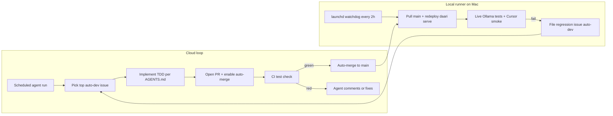

# AUTOMATION.md — the autonomous dev loop

> How daari develops itself with minimal human involvement. Agent contract: [AGENTS.md](https://github.com/naveenreddyalka/daari/blob/main/AGENTS.md).

## The loop



## Components

| Piece | Where | State |
|-------|-------|-------|
| Backlog | GitHub issues labeled `auto-dev` (+`P1/P2/P3`) | seeded #1–#8 |
| Agent contract | [AGENTS.md](https://github.com/naveenreddyalka/daari/blob/main/AGENTS.md) | active |
| Merge gate | branch protection on `main` (requires CI check `test`, strict, no force-push) + repo auto-merge | active |
| Dev-cycle agent | Cursor Automation draft: [automations/dev-cycle.md](automations/dev-cycle.md); CI fallback: [.github/workflows/autodev.yml](https://github.com/naveenreddyalka/daari/blob/main/.github/workflows/autodev.yml) | fallback committed; needs `CURSOR_API_KEY` secret or Automation creation |
| PR review agent | [automations/pr-review.md](automations/pr-review.md) or enable Bugbot on cursor.com | draft |
| Scout (continuous improvement) | [automations/scout.md](automations/scout.md) — weekly competitive survey files new `auto-dev` issues | draft |
| Local watchdog | `scripts/autodev-local.sh` + launchd (`com.daari.serve`, `com.daari.autodev`) | installed and validated |

## Local watchdog (Mac)

Every 2h (`com.daari.autodev`): pull `main` → reinstall if `pyproject.toml` changed → restart `daari serve` (kept alive by `com.daari.serve`) → run `pytest -m integration` against live Ollama → Cursor-shaped streaming smoke (18 tools + `input_text`) → on failure, file a deduped GitHub issue labeled `auto-dev,regression`.

```bash
scripts/autodev-local.sh              # run one cycle now
scripts/autodev-local.sh --install    # install + start launchd agents
scripts/autodev-local.sh --uninstall  # stop everything
tail -f ~/.daari/autodev/watchdog.out.log
```

## One-time activations (human, ~5 min total)

1. **Cloud dev cycle** — either:
   - Add repo secret: `gh secret set CURSOR_API_KEY` (key from cursor.com/settings) → the scheduled workflow starts working, or
   - Create the Cursor Automation from [automations/dev-cycle.md](automations/dev-cycle.md) in the Agents Window.
2. **PR review** — enable Bugbot for the repo on cursor.com/dashboard, or create the automation from [automations/pr-review.md](automations/pr-review.md).
3. **Scout** — create the automation from [automations/scout.md](automations/scout.md).

## Pausing / stopping

| What | How |
|------|-----|
| Local watchdog | `scripts/autodev-local.sh --uninstall` |
| CI dev cycle | `gh secret delete CURSOR_API_KEY` or `gh workflow disable autodev-cycle` |
| Cursor Automations | disable in cursor.com dashboard |
| Everything merge-related | branch protection stays; nothing lands without green CI |

## Escalation / notifications

- Agent-blocked work → comment on the issue, `agent:working` label removed.
- Local regressions → issues labeled `regression` (deduped by title per commit).
- You only need to look at GitHub notifications for: blocked PRs, `regression` issues, red CI on main.

## Safety rails

- Agents touch only `auto-dev` issues; human-only actions (tags, releases, force-push, dep bumps, workflow edits) are enumerated in [AGENTS.md](https://github.com/naveenreddyalka/daari/blob/main/AGENTS.md).
- `main` is protected: CI `test` check required, strict up-to-date, force-pushes and deletions blocked.
- Local watchdog is read-only on the repo except `gh issue create`.
