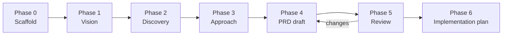

# PRD Plan — daari

> **Purpose:** Define *how* we go from "empty repo" to an approved PRD ready for implementation.  
> **Status:** Phase 5 — PRD v0.3 review (competitive analysis + plan review added)  
> **Owner:** Naveen Reddy Alka

---

## Goal

Produce a **complete, approved PRD** in this repo that answers:

- What daari is and is not
- Who it is for and why they care
- Core user stories and success metrics
- Technical approach (language, architecture, hosting)
- Scope boundaries and phased delivery
- Testing and quality expectations

Everything is versioned in git. Nothing lives only in chat.

---

## Phases



| Phase | Name | Output | Gate |
|-------|------|--------|------|
| **0** | Scaffold | Repo structure, this plan, CONTEXT.md | ✅ Done when pushed to `main` |
| **1** | Vision | One-paragraph pitch + problem statement | You approve the "why" |
| **2** | Discovery | User personas, constraints, competitors/alternatives | You approve scope direction |
| **3** | Approach | Language/stack options, architecture sketch, ADR-001 | You pick an approach |
| **4** | PRD draft | Full PRD in `docs/prd/PRD.md` | Internal consistency check |
| **5** | Review | Your edits + sign-off | Explicit "PRD approved" |
| **6** | Implementation plan | `docs/plans/YYYY-MM-DD-<feature>.md` | Ready to code |

---

## Deliverables by phase

### Phase 0 — Scaffold *(this commit)*

- [x] `README.md`, `CONTEXT.md`
- [x] `docs/PRD-PLAN.md` (this file)
- [x] `docs/discovery/` workspace
- [x] `docs/prd/` placeholder
- [x] `docs/adr/` for decisions
- [x] `.gitignore`

### Phase 1 — Vision

**File:** `docs/discovery/01-vision.md`

| Section | Questions to answer |
|---------|---------------------|
| Elevator pitch | What is daari in one sentence? |
| Problem | What pain exists today? |
| Insight | Why now? Why you? |
| Name | Why "daari"? Does the Telugu meaning ("path/way") inform the product? |
| Non-goals | What is this definitely *not*? |

**Exit criteria:** You read it and say "yes, that's the problem I want to solve."

### Phase 2 — Discovery

**File:** `docs/discovery/02-discovery.md`

| Section | Questions to answer |
|---------|---------------------|
| Users | Primary and secondary personas |
| Jobs to be done | What are they trying to accomplish? |
| Current alternatives | How do they solve this today? |
| Constraints | Time, budget, privacy, offline, platforms |
| Risks | What could kill the project? |
| Success metrics | How do we know it worked? |

**Activities:**

- Structured Q&A (one topic at a time)
- Optional: competitor/alternative scan
- Optional: rough user journey sketch

**Exit criteria:** Scope is bounded enough for one PRD (or we split into sub-projects).

### Phase 3 — Approach

**Files:**

- `docs/discovery/03-approach-options.md` — 2–3 options with trade-offs
- `docs/adr/0001-tech-stack.md` — chosen approach (ADR format)

| Decision area | Options to evaluate |
|---------------|---------------------|
| **Product shape** | Web / mobile / CLI / desktop / API-only / hybrid |
| **Language** | TypeScript, Python, Rust, Go, etc. — fit for problem |
| **Frontend** | React, Svelte, native, terminal UI, none |
| **Backend** | Serverless, single server, edge, local-first |
| **Data** | SQLite, Postgres, files, cloud DB, none |
| **AI/agents** | Core feature vs. optional vs. none |
| **Hosting** | Local, Vercel, Fly, GCP, self-hosted |

**Process:**

1. Agent proposes 2–3 stacks with pros/cons/recommendation
2. You pick one (or hybrid)
3. Record in ADR-0001

**Exit criteria:** Stack and architecture direction locked.

### Phase 4 — PRD draft

**File:** `docs/prd/PRD.md`

Uses this structure:

```markdown
# daari — Product Requirements Document

## Problem Statement
## Solution
## User Stories          (numbered, extensive)
## Implementation Decisions
## Testing Decisions
## Out of Scope
## Further Notes
## Phased Delivery       (MVP → v1 → later)
```

**Also create:**

- `docs/prd/glossary.md` — domain terms (if any)
- Module sketch — major components, no file paths

**Exit criteria:** No TBD placeholders; spec self-review passed.

### Phase 5 — Review

- You review `docs/prd/PRD.md`
- Changes go through git (commits on a branch or main)
- Sign-off recorded in PRD header: `Status: Approved — YYYY-MM-DD`

### Phase 6 — Implementation plan

**File:** `docs/plans/YYYY-MM-DD-mvp.md`

- Bite-sized tasks, TDD where applicable
- Only after PRD approved
- Separate from PRD (plan can change; PRD should not drift silently)

---

## Session workflow

Each working session:

1. **Read** CONTEXT.md + latest discovery doc
2. **Work** one phase section at a time (no skipping)
3. **Commit** with conventional messages, e.g. `docs: add vision draft`
4. **Push** to `origin/main` (or PR branch for larger reviews)

### Git commit conventions

```
docs: <what changed>       # discovery, PRD, ADR
chore: <what changed>      # repo setup, gitignore
feat: <what changed>       # only after Phase 6
```

---

## Skills strategy

| Skill type | Location | When |
|------------|----------|------|
| **daari-specific** | `.cursor/skills/` in this repo | Workflow unique to this product |
| **Reusable across projects** | `github.com/naveenreddyalka/agent-skills` | Generic patterns (PRD, triage, deploy, etc.) |

**Rule:** If a skill could help `next`, `daari`, or future repos → separate repo.  
**Install:** Symlink or copy into `~/.cursor/skills/` / `~/.claude/skills/`.

Create `agent-skills` repo when the first reusable skill is written.

---

## Roles

| Role | Who | Responsibility |
|------|-----|----------------|
| Product owner | Naveen | Vision, approvals, priority |
| Agent | Cursor/Claude | Draft docs, research, propose options |
| Reviewer | Naveen | Approve each phase gate |

---

## Timeline (suggested)

| Week | Focus |
|------|-------|
| **1** | Phase 1–2: Vision + Discovery |
| **2** | Phase 3: Approach + ADR-0001 |
| **3** | Phase 4–5: PRD draft + review |
| **4** | Phase 6: Implementation plan → start MVP |

Adjust as needed. Quality of thinking beats speed.

---

## Next action

**→ PRD v0.4 approval** — all plan review issues resolved. See [`docs/prd/PLAN-REVIEW.md`](docs/prd/PLAN-REVIEW.md).

Then: Phase A implementation plan.
