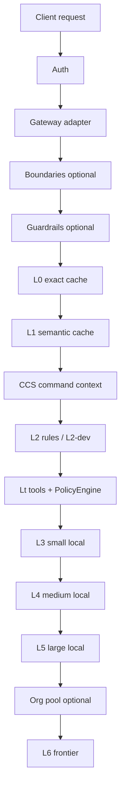

# Routing tiers

**Outcome:** Understand the ordered pipeline that turns a request into a response (and a tier label).

## Pipeline

| Tier | Role | Marginal cost |
|------|------|---------------|
| **L0** | Exact cache (identical prompt) | $0 |
| **L1** | Semantic cache (similar meaning) | $0 |
| **CCS** | Reuse command/tool output across turns | $0 |
| **L2** | Deterministic rules / transforms | $0 |
| **Lt** | Shell/IDE tools (policy gated) | $0 compute |
| **L3–L5** | Local models (Ollama or MLX) | Electricity |
| **L6** | Frontier APIs (OpenAI, Anthropic, …) | Paid |

**$0 tiers** = L0, L1, L2, Lt (no frontier invoice).

## Escalation

Local models escalate on low confidence, latency budget miss, or capability gaps (tools/vision/json). Caps:

- Config: `routing.max_tier_for_chat`, `routing.no_frontier` (via project profile)
- Headers: `X-Daari-Tier-Cap`, `X-Daari-No-Frontier`, `X-Daari-Tier-Override`

Agent/`tool_calls` flows skip caches (see ADR-0004).

## Knobs

See [Config overview](../guides/configuration/overview.md) and [Config reference](../reference/config.md).

## Next

→ [Caching and trust](caching-and-trust.md) · [Headers](../reference/headers.md)
