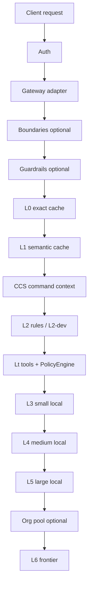

# Routing tiers

**Outcome:** Understand the ordered pipeline that turns a request into a response (and a tier label).

## Pipeline

| Tier | Role | Marginal cost |
|------|------|---------------|
| **L0** | Exact cache (identical prompt) | $0 |
| **L1** | Semantic cache (similar meaning) | $0 |
| **CCS** | Reuse command/tool output across turns | $0 |
| **L2** | Deterministic rules / transforms | $0 |
| **Lt** | Shell/IDE tools (policy gated) | $0 compute |
| **L3–L5** | Local models (Ollama or MLX) | Electricity |
| **L6** | Frontier APIs (OpenAI, Anthropic, …) | Paid |

**$0 tiers** = L0, L1, L2, Lt (no frontier invoice).

## Escalation

Local models escalate on low confidence, latency budget miss, or capability gaps (tools/vision/json). Caps:

- Config: `routing.max_tier_for_chat`, `routing.no_frontier` (via project profile)
- Headers: `X-Daari-Tier-Cap`, `X-Daari-No-Frontier`, `X-Daari-Tier-Override`

Agent/`tool_calls` flows skip L1 and Lt/L2. Exact L0 is on for an identical full history + tools schema; changing the last tool result is a miss (ADR-0004 / G1).

## Shadow evals for tier decisions

"Would a bigger model have answered differently?" is measurable without
changing what users see. With `routing.shadow_sample_rate > 0`, that fraction
of responses served by a local tier (L3–L5, not cache hits, not tool flows) is
replayed in a background task at a comparison tier and the two answers are
compared with the same embedder/cosine path the L1 shadow check uses. The
served response is never delayed or altered; the replay is executor-only, so it
writes nothing to the caches, adds no usage-ledger row, and is not a
learned-routing outcome.

- `routing.shadow_compare_tier` — empty (default) means the highest configured
  local tier, so measuring routing quality costs $0. `L6` replays against the
  frontier and is honoured only while `routing.shadow_daily_usd > 0`; the
  in-memory daily estimate stops replays at the cap.
- A replay against the same model as the one that served (e.g. a single-model
  install) is skipped — there is nothing to compare.

Results land per category in the feedback store next to the cache false-hit
rate: `daari learn stats` prints a "Tier divergence" table (samples, agree%,
diverge%, comparison tier), `daari report` / `GET /v1/daari/report` carry
`tier_divergence`, `GET /v1/daari/learn/stats` carries `tier_shadow`, and
Prometheus exports `daari_tier_shadow_samples_total{agreed="true|false"}`.
Default off; tests set the rate explicitly so the suite stays deterministic.

## Session affinity

`routing.session_affinity` (default off) keeps an agent loop on the model that
planned the task. A continuation — tool results after an assistant tool-call,
or the same user-turn prefix — replays that tier. A new human turn re-routes.

Session identity is `X-Daari-Session` or the OpenAI `user` field when present,
otherwise a hash of the user/system prefix. Pins expire after
`routing.session_affinity_ttl_seconds` (default 30 minutes). Confidence
failure, context-length failover, an open circuit, a down model, and
`X-Daari-Tier-Cap` beat the pin. Hits log `session_pin`; overrides log
`session_pin_override`.

## Stall escalation

`routing.stall_escalation.enabled` (default off) looks only at the request's
tool history. Three identical calls (same name and normalized arguments) in
the last six tool calls, or three consecutive error tool results, bump the
chosen tier by one. `X-Daari-Tier-Cap` and `routing.max_tier_for_chat` still
win. The event is `stall_escalation` with the pattern and repeat count.

## Knobs

See [Config overview](../guides/configuration/overview.md) and [Config reference](../reference/config.md).

## Next

→ [Caching and trust](caching-and-trust.md) · [Headers](../reference/headers.md)
