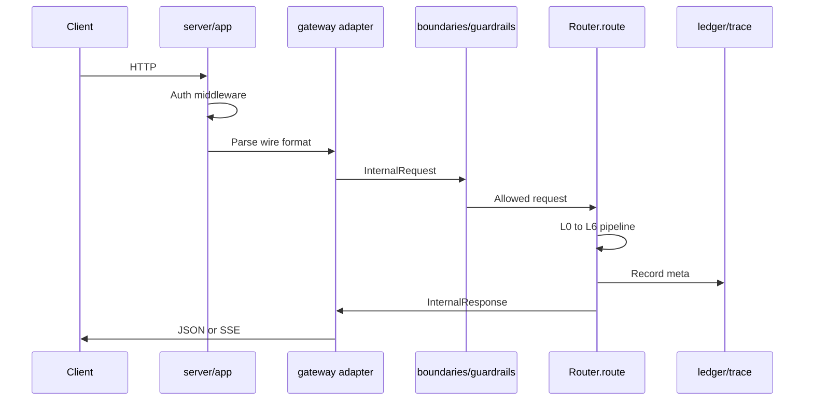

# Request lifecycle

Key types: `InternalRequest`, `InternalResponse`, `DaariMeta` in `daari/gateway/internal.py`.

`AppContext.from_settings` builds caches, executors, guardrails, and `BoundaryEngine`. Hot reload of boundaries/config editor calls `engine_from_settings` again.
