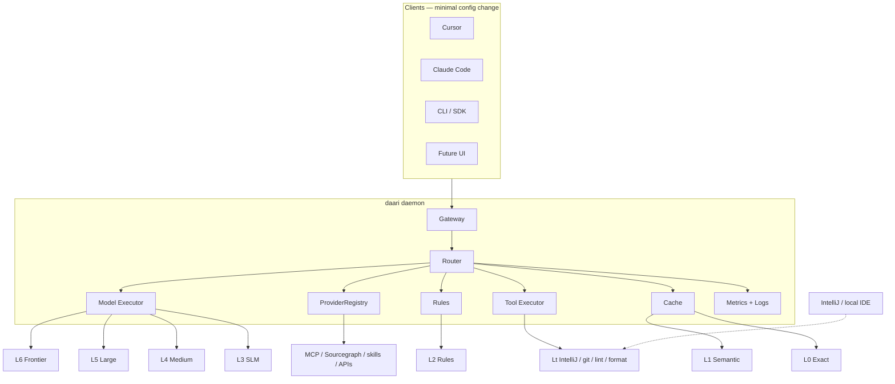

# daari — Product Requirements Document

> **Status:** Draft v0.4 — not approved  
> **Last updated:** 2026-06-15  
> **Owner:** Naveen Reddy Alka

---

## Problem Statement

Developer workflows today over-rely on frontier AI (OpenAI, Anthropic) for **everything** — including tasks that are repeated, trivial, cacheable, or better handled by **existing local tools** (IDE refactorings, linters, formatters, git, build tools).

Additionally, each AI-enabled tool (Cursor, Claude Code, custom CLIs, future UIs) is configured separately. There is no **single local layer** that:

- Routes work to the cheapest capable path
- Works across IDEs and CLIs with minimal change
- Installs and wires up in one shot

This wastes money, adds latency, leaks code to the cloud unnecessarily, and ignores capabilities already present in tools like IntelliJ that need no model at all.

## Product principles

daari is **not** another cloud LLM proxy. It is an **open-source, local-first execution platform** built to **run as much as possible cheaply on your machine**.

| Principle | Meaning |
|-----------|---------|
| **Open source** | Core daari (router, cache, setup, CLI) is OSS (Apache 2.0). No vendor lock-in. |
| **Local-first** | Default path is on-device: cache → rules → tools → local models. |
| **Cost-minimize** | Every request takes the cheapest capable tier. Frontier (L6) is last resort. |
| **AI is optional** | Many tasks need no model at all (Lt tool-native tier). |
| **Not tied to one API shape** | OpenAI-compat is **adapter #1**, not identity. Add Anthropic, MCP, others as the ecosystem shifts — [ADR-0007](0007-pluggable-gateway-adapters.md). |
| **Not a proxy** | Gateways translate wire formats; daari's job is local routing and cost optimization. |
| **Privacy by default** | Routable work stays on your machine. No telemetry unless you opt in. |

**Competitive context:** See [Competitive landscape](../discovery/04-competitive-landscape.md) and [Plan review](PLAN-REVIEW.md).

## Solution

**daari** is an **open-source local execution router** — not a pass-through proxy to cloud APIs. It is an end-to-end local daemon and setup tool that sits between any client (Cursor, Claude Code, CLI, UI, IDE) and the backends that can actually do the work **at lowest cost**.

For each incoming request, daari picks the **cheapest capable path**:

| Tier | Path | AI required? |
|------|------|--------------|
| **L0** | Exact cache | No |
| **L1** | Semantic cache | No |
| **L2** | Rules / templates | No |
| **L2-dev** | Developer command rules | No — detect run script/test/lint |
| **L2-live** | Live factual rules | No — weather, search, prices — [ADR-0009](../adr/0009-live-factual-fetch-l2-live.md) |
| **CCS** | Command context store | No — reuse prior command/output (incl. fetch results) |
| **Lt** | Tool-native execution | **No** — run the command/tool |
| **L3** | Small local model (SLM) | Yes — local |
| **L4** | Medium local model | Yes — local |
| **L5** | Large local model | Yes — local |
| **L6** | Frontier API | Yes — cloud (last resort) |

**Design principle:** do as much as possible **locally** and **without AI**. Models are one backend among many — not the default.

The name *daari* (Telugu: path) reflects routing each task to the right path: cache, existing tool, local model, or — only when needed — frontier.

### Why OpenAI-compatible API first? (not forever)

OpenAI-compat is the **first pluggable gateway adapter** — not daari's identity or only interface.

| Why first | Why not forever |
|-----------|-----------------|
| Cursor, SDKs, Ollama ecosystem use it today | Anthropic Messages API powers Claude Code |
| Fastest path to first working client | MCP may grow for agents |
| Minimal config change (`base_url`) | Future formats get new adapters, same router |

**Extensibility:** All adapters translate to a canonical internal request → router → response. Add adapters when adoption justifies it; never rewrite the router for a new wire format.

| Adapter | Phase | Clients |
|---------|-------|---------|
| OpenAI-compat | A | Cursor, SDK, curl |
| Anthropic-compat | C2 | Claude Code |
| MCP | C1 | MCP agents |
| daari-native | C1+ | Future UI, rich metadata |

Full adapter architecture: [ADR-0007](../adr/0007-pluggable-gateway-adapters.md)

## User Stories

### Routing & execution

1. As a developer, I want daari to automatically classify incoming requests, so that small tasks never reach frontier APIs.
2. As a developer, I want daari to expose an OpenAI-compatible local API, so that I can point Cursor, Claude Code, and SDKs at it with only a base URL change.
3. As a developer, I want daari to route repeated prompts to cache, so that identical work is free and instant.
4. As a developer, I want daari to route semantically similar prompts to cache, so that near-duplicates also avoid model calls.
5. As a developer, I want daari to apply rule-based transforms for known patterns, so that structured tasks need no LLM at all.
6. As a developer, I want daari to dispatch tasks to native IDE/CLI capabilities when possible, so that refactorings and tool operations do not invoke AI at all.
7. As a developer, I want daari to escalate to a larger local model when a small model's confidence is low, so that quality is preserved without calling the cloud.
8. As a developer, I want daari to log which tier handled each request, so that I can verify routing decisions.
9. As a developer, I want daari to fail clearly when no tier can handle a request, so that I am not silently given garbage output.

### Tool-native execution (no AI)

10. As a developer, I want daari to recognize tasks mappable to IDE built-ins (e.g. IntelliJ rename, find usages, optimize imports), so that those run via the IDE instead of a model.
11. As a developer, I want daari to invoke local CLI tools (formatter, linter, git, build) when they satisfy the request, so that deterministic tooling is preferred over inference.
12. As a developer, I want tool-native execution to work even when my primary UI is Cursor or Claude Code, so that daari bridges AI clients and non-AI backends.
13. As a developer, I want daari to report when a response came from a tool vs a model, so that I understand what actually ran.
14. As a developer, I want daari to require confirmation before Lt runs destructive IDE actions (rename, delete, mass refactor), so that tool-native dispatch cannot silently corrupt my codebase — see [ADR-0012](../adr/0012-execution-policy.md).

**Lt phasing:** Phase B starts with **git, formatter, linter only** (non-destructive CLI). IntelliJ and destructive ops in Phase B.1 with confirmation gate — see [routing-spec](routing-spec.md#lt-matching-phase-b).

### Caching

15. As a developer, I want exact-match caching keyed on prompt + relevant parameters, so that deterministic repeats hit L0.
16. As a developer, I want semantic caching using local embeddings, so that paraphrased repeats still hit cache.
17. As a developer, I want configurable cache TTL and invalidation, so that stale answers expire.
18. As a developer, I want to bypass cache per request, so that I can force fresh inference when debugging.
19. As a developer, I want to inspect cache entries and hit rates, so that I can tune what is worth caching.

### Local models

20. As a developer, I want daari to use Ollama (or equivalent) for local inference, so that I do not build model serving from scratch.
21. As a developer, I want different model sizes mapped to tiers (SLM / medium / large), so that routing maps to capability.
22. As a developer, I want daari to run on Apple Silicon macOS, so that it fits my daily dev machine.
23. As a developer, I want daari to respect memory and concurrency limits, so that local inference does not freeze my machine.

### Classification & routing logic

24. As a developer, I want daari to detect task types (tool-native, classify, extract, transform, generate), so that routing is task-aware not random.
25. As a developer, I want routing based on prompt size, structure, and task type, so that large/complex requests skip inappropriate tiers.
26. As a developer, I want a dry-run mode that shows the chosen path without executing, so that I can debug routing rules.
27. As a developer, I want to override the tier manually per request, so that I can force a specific model, tool, or cache bypass.

### Operations & observability

28. As a developer, I want a CLI to start/stop the daemon and view stats, so that operation is scriptable.
29. As a developer, I want per-tier counters (hits, misses, latency, errors), so that I can measure frontier avoidance and tool-native usage.
30. As a developer, I want request/response logs with redaction options, so that I can debug without leaking secrets to disk.
31. As a developer, I want daari to start on login optionally, so that it is always available like other dev services.

### Universal integration (any tool, minimal change)

32. As a developer, I want to use daari with Cursor with minimal config change, so that my existing IDE workflow keeps working.
33. As a developer, I want to use daari with Claude Code with minimal config change, so that CLI agent sessions route through daari *(Phase B — requires Anthropic gateway)*.
34. As a developer, I want to use daari with any OpenAI-compatible client, so that future tools work without daari-specific code.
35. As a developer, I want daari to accept standard chat completion payloads, so that existing SDKs work unchanged.
36. As a developer, I want streaming responses supported for model tiers, so that UX matches direct API usage.
37. As a developer, I want daari to handle tool-call shaped requests gracefully, so that agent workflows do not break — see [ADR-0004](../adr/0004-agent-tool-call-compatibility.md).
38. As a developer, I want to use daari alongside a traditional IDE (IntelliJ, VS Code) without replacing it, so that AI clients and classic IDEs cooperate through daari's tool-native tier.

### One-click / single-command setup

39. As a developer, I want a single install command that sets up daari, local models, and the daemon, so that I am not manually wiring pieces.
40. As a developer, I want `daari setup <tool>` recipes for Cursor, Claude Code, and generic OpenAI clients, so that each tool is configured automatically or via a guided one-step flow — see [setup-spec](setup-spec.md).
41. As a developer, I want setup to detect which tools are already installed, so that only relevant configs are applied.
42. As a developer, I want setup to be idempotent and reversible (`daari setup --undo`), so that I can re-run or undo without breaking my tools.
43. As a developer, I want a health check after setup (`daari doctor`), so that I know the full stack works before coding.

### Quality & safety

44. As a developer, I want confidence thresholds before accepting a small model answer, so that weak outputs escalate instead of shipping — see [routing-spec](routing-spec.md#confidence-scoring).
45. As a developer, I want an eval set of labeled prompts with expected tiers, so that routing changes are regression-tested.
46. As a developer, I want daari to never cache requests marked sensitive, so that secrets are not persisted.

### Configuration

47. As a developer, I want a single config file for tiers, models, tools, thresholds, and cache settings, so that setup is reproducible.
48. As a developer, I want sensible defaults that work with one local Ollama model, so that MVP setup is fast.
49. As a developer, I want to disable frontier APIs entirely in config, so that no request can leak to the cloud.

### Future (out of MVP, in product vision)

50. As a developer, I want an MCP server exposing daari routing, so that agents can query tier decisions natively.
51. As a developer, I want per-project routing profiles, so that different repos can have different tier maps.
52. As a developer, I want daari to learn from corrections (user rejected cache hit), so that routing improves over time.
53. As a developer, I want Anthropic-compatible API shape as an optional second gateway, so that tools requiring Claude wire format integrate without translation layers in the client.

### Local model improvement (later phases)

54. As a developer, I want daari to learn from my local usage (accepted responses, corrections, tier overrides), so that routing and model selection improve on my machine over time.
55. As a developer, I want daari to recommend or auto-select the best local Ollama model per task type based on my hardware and feedback, so that I don't manually tune tiers.
56. As a developer, I want optional local fine-tuning or adapter training from my session data, so that a personal local model gets better for my codebase and workflow.
57. As a developer, I want to opt in to share anonymized routing feedback, so that future daari releases improve defaults for everyone — without sharing my code or prompts by default.

### Developer commands & context (L2-dev + CCS)

58. As a developer, I want daari to recognize when I'm asking to run a basic command or script (not generate prose), so that it executes locally instead of calling a model.
59. As a developer, I want executed command output stored in a **command context cache (CCS)**, so that repeat questions reuse prior results without re-running.
60. As a developer, I want my project to define safe commands in `.daari/commands.yaml`, so that team/enterprise workflows are allowlisted and reusable.
61. As a developer, I want daari to inject recent command context into the next agent response, so that follow-up questions ("what did lint say?") don't need a model or re-execution.

**Design:** L2-dev rules detect → Lt executes → CCS remembers — [ADR-0008](../adr/0008-developer-command-rules-and-context-cache.md).

### Live factual queries (L2-live + Lt-fetch)

62. As a developer, I want daari to answer live factual questions (weather, prices, news) by fetching real sources—not hallucinating via a model—when a configured provider exists.
63. As a developer, I want live fetch results cached briefly (CCS), so that "weather today?" twice in an hour doesn't re-hit the API or a model.
64. As a developer, I want to configure external sources in `sources.yaml` (API keys, enable/disable), so that I control what leaves my machine and when.
65. As a developer, I want daari to use **Google Search** (official API or browser with my Google login) for live facts, so that one source covers weather, news, and general queries without an LLM.
66. As a developer, I want a **browser extension** paired to daari that uses my existing Google session, so that I don't store Google credentials in daari but still get authenticated search results.
67. As a developer, I want Lt-fetch to try structured APIs first and Google/browser second (configurable priority), so that I balance speed, accuracy, and auth needs.
68. As a developer, I want **both** open API integrations (Open-Meteo, etc.) **and** Google integrations (CSE API + browser) available—not one or the other—so that I can use the best source per query type.

### Enterprise & local integrations (provider framework)

69. As a developer, I want a **pluggable provider registry** at daari's core, so that MCP servers, enterprise APIs, and skills can be added in later phases without rewriting the router.
70. As a developer, I want to register **local or company MCP servers** (Sourcegraph, internal git, corp tools), so that code search and internal APIs run without an LLM.
71. As a developer, I want to configure **enterprise APIs** (Sourcegraph, GitHub Enterprise, GitLab) in `integrations.yaml`, so that company-local services are first-class backends.
72. As a developer, I want **skills** (packaged rules + provider actions) loadable from `.daari/skills/` or a skills repo, so that teams ship integrations without forking daari.

**Design:** [integrations.md](integrations.md) · [ADR-0011](../adr/0011-pluggable-integration-providers.md)

Live factual queries (stories 62–68): [sources-integration.md](sources-integration.md) · [ADR-0009](../adr/0009-live-factual-fetch-l2-live.md) · [ADR-0010](../adr/0010-browser-bridge-google-search.md)

### Execution policy (Lt) & CCS cache policy

73. As a developer, I want daari to apply a **deny / ask / allow** policy before any Lt execution, so that unknown or dangerous commands never run silently.
74. As a developer, I want allowlists merged from global, user, and project config (`.daari/commands.yaml`), so that team-safe commands are explicit and blocklist always wins.
75. As a developer, I want a confirmation flow for destructive or unlisted commands, so that I approve before IntelliJ rename or custom scripts run — [ADR-0012](../adr/0012-execution-policy.md).
76. As a developer, I want sensitive or opted-out commands excluded from CCS, with TTL and redaction, so that cached command output does not leak secrets or go stale.
77. As a developer, I want to invalidate or clear command context (`re-run`, `daari context clear`), so that I can force fresh execution when CCS would otherwise serve old output.

**Lt phasing:** Phase B.0 = allowlist + blocklist + default deny unknown. Phase B.1 = confirmation gate + project commands + context clear CLI.

## Implementation Decisions

### Product shape

daari is an **end-to-end local platform**, not just a proxy:

| Component | Role |
|-----------|------|
| **Local daemon** | Long-running router + executors on macOS |
| **OpenAI-compatible gateway** | Primary integration — minimal change for any compatible client |
| **Tool executor registry** | Maps tasks → IDE/CLI backends (IntelliJ, git, formatter, etc.) |
| **Setup / installer** | Single-command install + per-tool setup recipes |
| **CLI companion** | serve, setup, doctor, stats, dry-run |
| **Not in scope** | Chat UI, model training, replacing IDEs |

### Integration strategy: universal, minimal change

```
┌─────────────────────────────────────────────────────────┐
│  Clients (change almost nothing)                        │
│  Cursor · Claude Code · custom CLI · SDK · future UI    │
└──────────────────────────┬──────────────────────────────┘
                           │ OpenAI-compatible API
                           │ (base_url → localhost:daari)
                           ▼
┌─────────────────────────────────────────────────────────┐
│  daari daemon                                           │
│  Gateway → Router → [Cache | Rules | Tools | Models]    │
└──────────────────────────┬──────────────────────────────┘
                           │
         ┌─────────────────┼─────────────────┐
         ▼                 ▼                 ▼
    L0–L2 (no AI)    Lt tool-native     L3–L5 Ollama
    cache/rules      IntelliJ/git/      local models
                     linter/format
                           │
                           ▼ (last resort)
                        L6 frontier
```

**Per-tool setup** (target UX):

| Tool | Minimal change | Setup command |
|------|----------------|---------------|
| Cursor | Set custom model base URL + API key | `daari setup cursor` |
| Claude Code | Point API base URL in config/env | `daari setup claude-code` |
| Generic OpenAI SDK | `base_url` + `api_key` | `daari setup openai-compat` |
| IntelliJ | Register as tool backend (not AI client) | `daari setup intellij` |
| Any new tool | Same compat API if supported | `daari setup detect` |

**Single-click install (Phase A — repo script only):**

```bash
./install.sh          # Phase A: venv + deps + Ollama model pull
daari setup --all     # Phase B: configure detected tools
```

*Future:* hosted install URL when domain and release artifacts exist — see [setup-spec](setup-spec.md).

### Tiered execution model

| Tier | Name | Mechanism | AI? | Typical tasks |
|------|------|-----------|-----|---------------|
| L0 | Exact cache | Hash(prompt + params) | No | Identical repeats |
| L1 | Semantic cache | Local embedding similarity | No | Paraphrased repeats |
| L2 | Rules | Templates, regex, parsers | No | JSON format, field extract |
| **L2-dev** | Dev command rules | Pattern registry + `.daari/commands.yaml` | No | Detect run/test/lint/script intent |
| **CCS** | Command context | Prior run output keyed by command+cwd+repo | No | Reuse output; "what did test show?" |
| **Lt** | Tool-native | IDE/CLI subprocess, APIs | **No** | Execute command after L2-dev match |
| L3 | SLM | ~1–3B local model | Local | Classify, short extract |
| L4 | Medium | ~7–8B local model | Local | Docstrings, small codegen |
| L5 | Large local | ~13B+ quantized | Local | Heavier local generation |
| L6 | Frontier | OpenAI / Anthropic API | Cloud | Last resort — low confidence |

**Routing order:** L0 → **CCS** → L1 → **L2-dev** → **L2-live** → L2 → **Lt** (shell | fetch) → L3 → … → L6

After Lt runs a command: write **CCS** always; write **L0** if full response is cacheable.

### Routing pipeline

```
Request → normalize
  → L0? → CCS? → L1? → L2-dev? → L2-live? → L2?
  → PolicyEngine? → Lt? (shell | fetch | integration)
  → classify → L3? → L4? → L5? → L6 (last resort)
```

Lt branch runs only after PolicyEngine **ALLOW** (or confirmed ASK).

### Major modules (logical)

| Module | Responsibility |
|--------|----------------|
| **Gateway** | Pluggable adapters (OpenAI first) → canonical internal model → router |
| **Router** | Task classification, tier selection, escalation logic |
| **Cache** | L0 exact, L1 semantic, **CCS command context** |
| **Rules** | L2 generic + **L2-dev** developer command registry |
| **Tool executor** | IDE/CLI backends + **ProviderRegistry** (MCP, enterprise APIs) |
| **Model executor** | Ollama/local backends per tier L3–L5; frontier L6 |
| **ProviderRegistry** | Ground-level plugin system — all backends register here ([ADR-0011](../adr/0011-pluggable-integration-providers.md)) |
| **Integrations** | MCP servers, Sourcegraph, GHE, skills — config in `integrations.yaml` |
| **Setup** | Install scripts, per-tool config recipes, detect, doctor |
| **Observability** | Metrics, structured logs, CLI stats |
| **Config** | Tier map, models, tools, thresholds, policies |
| **PolicyEngine** | Lt deny/ask/allow; CCS eligibility — [ADR-0012](../adr/0012-execution-policy.md) |

### Architecture sketch



### Schema / API (MVP)

- `POST /v1/chat/completions` — OpenAI-compatible (primary)
- Headers: `X-Daari-Tier-Override`, `X-Daari-No-Cache`, `X-Daari-Prefer-Tool`
- Response extension `daari_meta`: `{ tier, cache_hit, executor, provider_id, tool, latency_ms, model }`

### Setup module (MVP scope)

| Command | Behavior |
|---------|----------|
| `daari install` | Install daemon, pull default Ollama model, register launchd (optional) |
| `daari setup cursor` | Write/patch Cursor custom model settings |
| `daari setup claude-code` | Patch Claude Code env/config for base URL |
| `daari setup intellij` | Register IntelliJ CLI/API path for Lt tier |
| `daari setup --all` | Detect installed tools, run applicable setups |
| `daari doctor` | Verify daemon, Ollama, tool paths, sample route |

### Live factual sources (open APIs + Google)

daari integrates **both** provider families for L2-live / Lt-fetch:

| Family | Examples | Phase |
|--------|----------|-------|
| **Open APIs** | Open-Meteo, wttr.in, pluggable REST | C1 |
| **Google** | Custom Search JSON API, browser extension + user auth | C1 + C2 |

User configures priority in `sources.yaml`. Full spec: [sources-integration.md](sources-integration.md) · Enterprise/MCP: [integrations.md](integrations.md)

### Client support matrix (honest)

| Client | MVP | v1 | Integration |
|--------|-----|-----|-------------|
| Cursor | ✅ | ✅ | OpenAI-compat base URL |
| OpenAI SDK / scripts | ✅ | ✅ | `base_url` override |
| Claude Code | ⚠️ manual | ✅ | Anthropic shape may need Phase B gateway |
| IntelliJ | — | ✅ Lt backend | Tool executor, not AI client |
| Generic UI | ⚠️ if OpenAI-compat | ✅ | Same as SDK |

### Open source & privacy commitments

- **License:** Apache 2.0 for daari core
- **Dependencies:** OSS-only for core path; no required proprietary services
- **Models:** User-provided via Ollama or local backends — daari does not ship weights
- **Frontier keys:** User-owned; stored locally; never sent to daari project infra
- **Telemetry:** Off by default; opt-in only if added later
- **Cache data:** Stored locally; user controls TTL and purge

### daari vs alternatives (summary)

| | Cloud gateways (LiteLLM, OpenRouter) | Local runners (Ollama) | **daari** |
|---|--------------------------------------|------------------------|-----------|
| Goal | Access many providers | Run one local model | **Minimize cost — local path for max tasks** |
| OSS | Mixed | Mostly | **Yes — full stack** |
| Non-AI tools | No | No | **Yes — Lt tier** |
| Dev tool setup | Manual | N/A | **`daari setup <tool>`** |

Full comparison: [04-competitive-landscape.md](../discovery/04-competitive-landscape.md)

## Testing Decisions

### Principles

- Test **behavior at module boundaries**, not internal routing implementation details
- Golden-file tests for tier selection on a labeled prompt set (include Lt cases)
- Integration tests against real Ollama optional; mock executors in unit tests
- Setup recipes tested in dry-run mode

### What gets tested

| Module | Tests |
|--------|-------|
| Router | Given prompt X → expect tier Y (including Lt) |
| Tool executor | Known refactor intent → dispatches to registered tool |
| Cache | Hit/miss, TTL expiry, bypass header |
| Rules | Known patterns → deterministic output |
| Gateway | API contract, streaming, error shapes |
| Setup | Recipe dry-run produces expected config diff |
| Config | Invalid config rejected at startup |

### Eval harness

- **Phase A (MVP):** 20 golden prompts in [routing-spec](routing-spec.md#golden-prompt-eval-set) — `evals/routing/prompts.jsonl`
- **Phase B:** Expand to full regression suite; run in CI
- Routing accuracy ≥90% on v1 eval set

## Out of Scope

### MVP
- Anthropic-native API gateway (OpenAI-compat only for MVP)
- MCP server
- Multi-user / remote deployment
- Model fine-tuning
- Windows / Linux
- Web dashboard
- Automatic learning from user corrections
- Full IntelliJ plugin (CLI/API integration first)

### Entire product (never, unless explicitly reopened)
- Training **foundation models from scratch**
- Hosted SaaS inference
- General consumer chat product
- Replacing IDEs entirely
- **Mandatory** upload of user prompts/code for model improvement

**Note:** Local **fine-tuning/adaptation** from user feedback and **opt-in** collective routing stats are **in scope** for Phase D — see user stories #54–57.

## Success metrics

| Metric | MVP target | v1 target | Definition |
|--------|------------|-----------|------------|
| **$0 tier rate** | ≥30% | ≥50% | % requests at L0/L1/L2/Lt (no model, no frontier cost) |
| **Local AI rate** | ≥20% | ≥30% | % at L3–L5 |
| **Frontier rate** | ≤50% | ≤20% | % at L6 |
| **Cost saved** | Measurable on eval set | ≥60% vs all-L6 baseline | Estimated $ on labeled dev prompt suite |
| **p50 latency (L0–Lt)** | <100ms | <100ms | Cache and tool tiers |
| **p50 latency (L3)** | <2s | <1s | Single local model |

Baseline for comparison: **all requests to frontier (L6)** — the default today without daari.

## Phased Delivery

### Phase A — Tracer bullet MVP (prove local cost wins)

**Goal:** Show daari saves money/latency with minimal scope. ~2–3 weeks.

- Daemon + OpenAI-compatible gateway
- L0 exact cache only
- L3 single Ollama model + heuristic router (prompt length/keywords)
- **`ProviderRegistry` + protocol (empty of enterprise; cache + ollama only)** — [ADR-0011](../adr/0011-pluggable-integration-providers.md)
- CLI: `daari serve`, `daari stats`
- **Manual** Cursor setup doc (automated `daari setup cursor` in Phase A.1)
- 10-prompt eval set with tier labels
- Metrics: $0 tier rate, frontier rate, latency

**Explicitly deferred from Phase A:** L1 semantic cache, Lt tier, L4/L5, L6 escalation, setup automation, Claude Code.

### Phase A.1 — Setup + frontier escalation

- `daari setup cursor` + `install.sh` + `daari doctor`
- L6 auto-escalate when local fails (ADR-0001)
- `daari setup` writes config backup (reversible)

### Phase B — v1 (full local-first stack)
- L1 semantic cache + L2 rules
- **L2-dev + CCS** — developer command detect, execute, remember output ([ADR-0008](../adr/0008-developer-command-rules-and-context-cache.md))
- **PolicyEngine** — allowlist, blocklist, confirmation ([ADR-0012](../adr/0012-execution-policy.md))
- **Lt (B.0)** — git, formatter, linter, **shell commands** from L2-dev match
- **Lt (B.1)** — IntelliJ CLI + destructive-op confirmation + `daari context clear`
- L4 medium model + confidence escalation to L6
- Setup recipes: `claude-code`, `openai-compat`, `intellij`
- `daari setup --all` + detect
- Full routing regression tests

### Phase C1 — v2a (agent + profiles + integration foundation)
- L5 large local tier
- MCP server for agent introspection + **MCP client** for local/corp servers
- **ProviderRegistry plugins** + skills loader — [integrations.md](integrations.md)
- L2-live + Lt-fetch (open APIs + Google CSE)
- Per-project routing profiles

### Phase C2 — v2b (client expansion)
- Anthropic-compat gateway (enables Claude Code setup)
- Richer IntelliJ / IDE tool registry
- Browser extension (Google auth for Lt-fetch)

### Phase C3 — enterprise integrations
- Sourcegraph, GitHub Enterprise, GitLab providers
- Company MCP servers + `integrations.yaml` enterprise config

### Phase D — local learning & collective improvement (future)

**Goal:** Improve local models and routing per installation; optional opt-in improvement for all users.

| Track | Scope | Privacy |
|-------|-------|---------|
| **D1 — Personal** | Local feedback loop: cache tuning, tier thresholds, model picker per task | All data stays on device |
| **D2 — Local fine-tune** | Fine-tune/adapt small local model from user corrections (not train foundation models) | User-owned weights in `~/.daari/models/` |
| **D3 — Opt-in collective** | Anonymized routing stats (tier success rates, latency) uploaded if user enables | No prompts/code unless explicitly opted in |
| **D4 — Release defaults** | daari project uses aggregated opt-in stats to improve out-of-box routing for next version | OSS transparent; user consent required |

**Out of scope for D:** training foundation models from scratch, mandatory cloud upload, using user code without explicit consent.

**Detailed breakdown:** [ROADMAP.md](ROADMAP.md) — languages, clients, and tools per phase.

## Open Decisions

| ID | Question | Options | Status |
|----|----------|---------|--------|
| **OD-1** | Frontier fallback policy? | Never / opt-in / auto-escalate | **Accepted: auto-escalate** — [ADR-0001](../adr/0001-frontier-fallback-policy.md) |
| **OD-2** | Primary language? | Rust / Go / Python / TypeScript | **Accepted: Python 3.12** — [ADR-0005](../adr/0005-python-tech-stack.md) |
| **OD-3** | Semantic cache store? | SQLite+vec / chroma / in-memory | **Draft: sqlite-vec** for v1 |
| **OD-4** | Classifier implementation? | Heuristics / SLM / hybrid | **Hybrid** — [routing-spec](routing-spec.md) |
| **OD-5** | IntelliJ integration mechanism? | CLI / REST / file-based | **Accepted: CLI first** — Phase B.1 |
| **OD-6** | Install delivery? | curl pipe / brew / npm / bundled binary | **Accepted: `./install.sh`** for MVP — [setup-spec](setup-spec.md) |
| **OD-7** | MVP scope | Tracer bullet vs full Phase A | **Accepted: tracer bullet** |

### Specification documents

| Doc | Purpose |
|-----|---------|
| [ROADMAP.md](ROADMAP.md) | **Detailed phase plan** — languages, clients, tools per phase |
| [integrations.md](integrations.md) | Provider framework, MCP, enterprise APIs |
| [sources-integration.md](sources-integration.md) | Open APIs + Google |
| [ADR-0012](../adr/0012-execution-policy.md) | Lt execution policy, CCS cache policy |
| [routing-spec.md](routing-spec.md) | Classifier, confidence, golden prompts |
| [setup-spec.md](setup-spec.md) | Install, setup recipes, undo |
| [glossary.md](glossary.md) | Terms |
| [PLAN-REVIEW.md](PLAN-REVIEW.md) | Issue tracker |

## Further Notes

- **daari ≠ proxy** — open-source local cost optimizer; compat API is the adapter
- **Ollama is a backend**, not a competitor — daari orchestrates it at L3–L5
- **Lt (tool-native)** is the key differentiator vs LiteLLM/Bifrost/GPTCache
- Telugu **daari** = path — routing metaphor covers models *and* tools
- Reusable skills → `agent-skills` repo; daari-specific → `.cursor/skills/` here

## Approval

- [x] Step 1 — Problem & principles approved — 2026-06-15
- [x] Step 2 — Solution & tiers approved — 2026-06-15
- [ ] Step 3 — User stories (full pass)
- [ ] Step 4 — Architecture & modules
- [ ] Step 5 — Phasing & MVP scope
- [ ] Step 6 — Metrics & evals
- [ ] Step 7 — Open decisions
- [ ] Step 8 — Specs & ADRs sign-off
- [ ] ADRs accepted: [0001](../adr/0001-frontier-fallback-policy.md) · [0002](../adr/0002-openai-compatible-api.md) · [0003](../adr/0003-tool-native-tier.md) · [0004](../adr/0004-agent-tool-call-compatibility.md) · [0005](../adr/0005-python-tech-stack.md) · [0006](../adr/0006-local-daemon-security.md) · [0007](../adr/0007-pluggable-gateway-adapters.md) · [0008](../adr/0008-developer-command-rules-and-context-cache.md) · [0009](../adr/0009-live-factual-fetch-l2-live.md) · [0010](../adr/0010-browser-bridge-google-search.md) · [0011](../adr/0011-pluggable-integration-providers.md) · [0012](../adr/0012-execution-policy.md)
- [ ] Specs reviewed: [routing-spec](routing-spec.md) · [setup-spec](setup-spec.md) · [integrations](integrations.md) · [sources-integration](sources-integration.md)
- [ ] PRD v0.4 approved — *date: _________*

### Step 2 — coverage notes (2026-06-15)

**In scope for Step 2 (documented):** tier stack L0–L6 + L2-dev + L2-live + CCS + Lt; routing order; gateway adapters; ProviderRegistry; execution policy; live sources; enterprise integration framework.

**Intentionally deferred (later steps / phases — not gaps blocking Step 2):**

| Topic | Where handled | Phase |
|-------|---------------|-------|
| Streaming responses | Story #36 | A stretch / B |
| Lt failure → L3 explain stderr | ADR-0012 opt-in `tools.explain_on_failure` | B.1+ |
| Long-running / background commands | Timeout in ADR-0012; no job queue | B+ |
| Session grants ("allow for 1h") | ADR-0012 non-goal | C+ |
| File-watch / auto re-run on save | Out of product scope | — |
| Multi-user / RBAC | Enterprise `allowed_providers` only | C1+ |
| Image / multimodal routing | Not in tier model | Future |

**Minor follow-ups (optional, not blocking):** align routing pipeline diagram with full order (include CCS, L2-dev, L2-live); add user story for offline/no-network mode when L6/L2-live unavailable.
