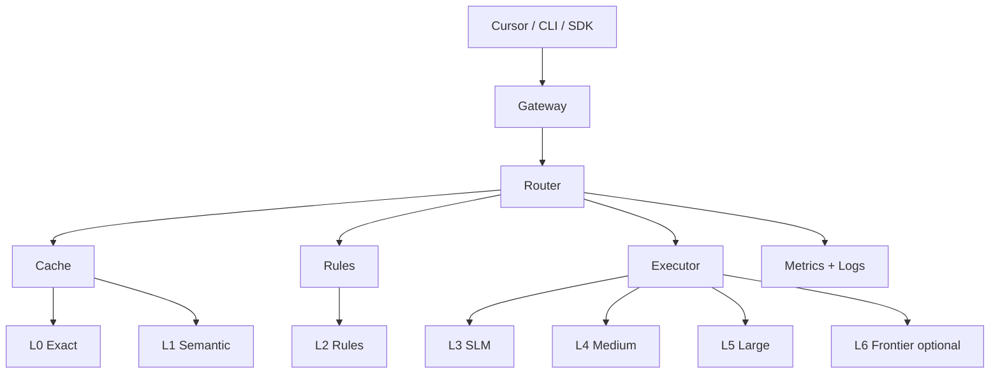

# daari — Product Requirements Document

> **Status:** Draft v0.1 — not approved  
> **Last updated:** 2026-06-15  
> **Owner:** Naveen Reddy Alka

---

## Problem Statement

Developer agent workflows today treat frontier models (OpenAI, Anthropic) as the default execution engine for **every** task — including small, repeated, and cacheable work that does not require frontier-class reasoning.

This wastes money, adds latency, sends local code and context to third-party APIs unnecessarily, and ignores the fact that the same task shapes recur constantly across a development session.

## Solution

**daari** is a local inference router and executor. It intercepts AI requests from tools (Cursor, CLI, scripts), classifies the task, and routes it through a **tiered local stack** before ever considering a frontier API:

1. **Exact cache** — identical request → instant response  
2. **Semantic cache** — similar request → reused response  
3. **Rules / templates** — deterministic transforms, no model  
4. **Small local model (SLM)** — classification, extraction, tiny completions  
5. **Medium local model** — moderate generation  
6. **Large local model** — heavier local work when hardware allows  
7. **Frontier API** — last resort only; auto-escalate when local tiers fail confidence checks

The name *daari* (Telugu: path) reflects the core idea: every request gets the **cheapest capable path**, not the most expensive default.

## User Stories

### Routing & execution

1. As a developer, I want daari to automatically classify incoming requests, so that small tasks never reach frontier APIs.
2. As a developer, I want daari to expose an OpenAI-compatible local API, so that I can point Cursor and other tools at it without code changes.
3. As a developer, I want daari to route repeated prompts to cache, so that identical work is free and instant.
4. As a developer, I want daari to route semantically similar prompts to cache, so that near-duplicates also avoid model calls.
5. As a developer, I want daari to apply rule-based transforms for known patterns, so that structured tasks need no LLM at all.
6. As a developer, I want daari to escalate to a larger local model when a small model's confidence is low, so that quality is preserved without calling the cloud.
7. As a developer, I want daari to log which tier handled each request, so that I can verify routing decisions.
8. As a developer, I want daari to fail clearly when no tier can handle a request, so that I am not silently given garbage output.

### Caching

9. As a developer, I want exact-match caching keyed on prompt + relevant parameters, so that deterministic repeats hit L0.
10. As a developer, I want semantic caching using local embeddings, so that paraphrased repeats still hit cache.
11. As a developer, I want configurable cache TTL and invalidation, so that stale answers expire.
12. As a developer, I want to bypass cache per request, so that I can force fresh inference when debugging.
13. As a developer, I want to inspect cache entries and hit rates, so that I can tune what is worth caching.

### Local models

14. As a developer, I want daari to use Ollama (or equivalent) for local inference, so that I do not build model serving from scratch.
15. As a developer, I want different model sizes mapped to tiers (SLM / medium / large), so that routing maps to capability.
16. As a developer, I want daari to run on Apple Silicon macOS, so that it fits my daily dev machine.
17. As a developer, I want daari to respect memory and concurrency limits, so that local inference does not freeze my machine.

### Classification & routing logic

18. As a developer, I want daari to detect task types (classify, extract, transform, generate), so that routing is task-aware not random.
19. As a developer, I want routing based on prompt size, structure, and task type, so that large/complex requests skip inappropriate tiers.
20. As a developer, I want a dry-run mode that shows the chosen path without executing, so that I can debug routing rules.
21. As a developer, I want to override the tier manually per request, so that I can force a specific model or cache bypass.

### Operations & observability

22. As a developer, I want a CLI to start/stop the daemon and view stats, so that operation is scriptable.
23. As a developer, I want per-tier counters (hits, misses, latency, errors), so that I can measure frontier avoidance.
24. As a developer, I want request/response logs with redaction options, so that I can debug without leaking secrets to disk.
25. As a developer, I want daari to start on login optionally, so that it is always available like other dev services.

### Integration

26. As a developer, I want to configure Cursor to use daari as the API base URL, so that my IDE sessions route through local tiers automatically.
27. As a developer, I want daari to accept standard chat completion payloads, so that existing SDKs work unchanged.
28. As a developer, I want streaming responses supported for local model tiers, so that UX matches direct API usage.
29. As a developer, I want daari to handle tool-call shaped requests gracefully (route or passthrough), so that agent workflows do not break.

### Quality & safety

30. As a developer, I want confidence thresholds before accepting a small model answer, so that weak outputs escalate instead of shipping.
31. As a developer, I want an eval set of labeled prompts with expected tiers, so that routing changes are regression-tested.
32. As a developer, I want daari to never cache requests marked sensitive, so that secrets are not persisted.

### Configuration

33. As a developer, I want a single config file for tiers, models, thresholds, and cache settings, so that setup is reproducible.
34. As a developer, I want sensible defaults that work with one local Ollama model, so that MVP setup is fast.
35. As a developer, I want to disable frontier APIs entirely in config, so that no request can leak to the cloud.

### Future (out of MVP, in product vision)

36. As a developer, I want an MCP server exposing daari routing, so that agents can query tier decisions natively.
37. As a developer, I want per-project routing profiles, so that different repos can have different tier maps.
38. As a developer, I want daari to learn from corrections (user rejected cache hit), so that routing improves over time.

## Implementation Decisions

### Product shape

- **Local daemon** — long-running process on macOS
- **OpenAI-compatible HTTP API** — primary integration surface for MVP
- **CLI companion** — stats, admin, dry-run
- **Not** a chat UI or model trainer

### Tiered execution model

| Tier | Name | Mechanism | Typical tasks |
|------|------|-----------|---------------|
| L0 | Exact cache | Hash(prompt + params) | Identical repeats |
| L1 | Semantic cache | Local embedding similarity | Paraphrased repeats |
| L2 | Rules | Templates, regex, parsers | JSON format, field extract |
| L3 | SLM | ~1–3B local model | Classify, short extract |
| L4 | Medium | ~7–8B local model | Docstrings, small codegen |
| L5 | Large local | ~13B+ quantized | Heavier local generation |
| L6 | Frontier | OpenAI / Anthropic API | Last resort when local confidence low |

### Routing pipeline

```
Request → normalize → L0? → L1? → L2? → classify task → L3? → confidence OK? → return
                                              ↓ fail confidence
                                         escalate L4 → L5 → L6? (policy)
```

### Major modules (logical)

| Module | Responsibility |
|--------|----------------|
| **Gateway** | HTTP API, auth (local), request normalization |
| **Router** | Task classification, tier selection, escalation logic |
| **Cache** | Exact + semantic stores, TTL, invalidation |
| **Rules** | Deterministic handlers registry |
| **Executor** | Calls Ollama/local backends per tier |
| **Observability** | Metrics, structured logs, CLI stats |
| **Config** | Tier map, models, thresholds, policies |

### Architecture sketch



### Schema / API (MVP)

- `POST /v1/chat/completions` — OpenAI-compatible
- Headers or fields for: `X-Daari-Tier-Override`, `X-Daari-No-Cache`
- Response includes `daari_meta`: `{ tier, cache_hit, latency_ms, model }` *(non-standard extension)*

## Testing Decisions

### Principles

- Test **behavior at module boundaries**, not internal routing implementation details
- Golden-file tests for tier selection on a fixed labeled prompt set
- Integration tests against real Ollama in CI optional; unit tests mock executor

### What gets tested

| Module | Tests |
|--------|-------|
| Router | Given prompt X → expect tier Y |
| Cache | Hit/miss, TTL expiry, bypass header |
| Rules | Known patterns → deterministic output |
| Gateway | API contract, streaming, error shapes |
| Config | Invalid config rejected at startup |

### Eval harness (v1)

- `evals/routing/` — labeled prompts with expected tier
- Run in CI: routing accuracy must not regress

## Out of Scope

### MVP
- MCP server
- Multi-user / remote deployment
- Model fine-tuning
- Windows / Linux
- Web dashboard
- Automatic learning from user corrections

### Entire product (never, unless explicitly reopened)
- Training foundation models
- Hosted SaaS inference
- General consumer chat product

## Phased Delivery

### Phase A — MVP (prove routing works)
- Daemon + OpenAI-compatible API
- L0 exact cache
- L3 via Ollama (single default model)
- Heuristic router (prompt length + keywords)
- CLI: `daari serve`, `daari stats`
- Cursor integration documented

### Phase B — v1 (real local-first stack)
- L1 semantic cache
- L2 rules engine
- L4 second model tier
- Confidence-based escalation
- Eval set + routing regression tests

### Phase C — v2
- L5 large local tier
- MCP server
- Per-project profiles
- Frontier policy implemented (whichever option chosen)

## Open Decisions

| ID | Question | Options | Recommendation |
|----|----------|---------|----------------|
| **OD-1** | Frontier fallback policy? | A) Never call frontier B) Opt-in per request C) Auto-escalate when local fails | **C — accepted** — auto-escalate as last resort when local confidence is low |
| **OD-2** | Primary language? | Rust / Go / Python / TypeScript | **Python or Go** — see `docs/discovery/03-approach-options.md` |
| **OD-3** | Semantic cache store? | SQLite+vec / embedded chroma / in-memory | Decide in approach phase |
| **OD-4** | Classifier implementation? | Heuristics only / SLM / hybrid | **Hybrid** for MVP |

## Further Notes

- Telugu **daari** = path — branding aligns with routing metaphor
- Reusable agent skills (PRD workflow, eval patterns) → separate `agent-skills` repo when extracted
- daari-specific skills (routing tuning, Ollama setup) → `.cursor/skills/` in this repo later

## Approval

- [ ] Vision approved
- [ ] Discovery approved
- [ ] Approach / ADR-0001 accepted
- [ ] PRD approved — *date: _________*
