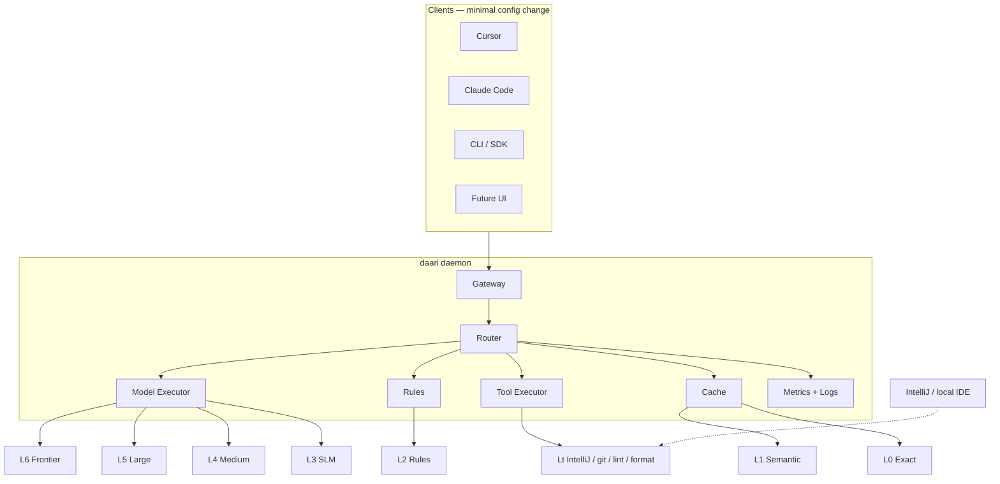

# daari — Product Requirements Document

> **Status:** Draft v0.4 — not approved  
> **Last updated:** 2026-06-15  
> **Owner:** Naveen Reddy Alka

---

## Problem Statement

Developer workflows today over-rely on frontier AI (OpenAI, Anthropic) for **everything** — including tasks that are repeated, trivial, cacheable, or better handled by **existing local tools** (IDE refactorings, linters, formatters, git, build tools).

Additionally, each AI-enabled tool (Cursor, Claude Code, custom CLIs, future UIs) is configured separately. There is no **single local layer** that:

- Routes work to the cheapest capable path
- Works across IDEs and CLIs with minimal change
- Installs and wires up in one shot

This wastes money, adds latency, leaks code to the cloud unnecessarily, and ignores capabilities already present in tools like IntelliJ that need no model at all.

## Product principles

daari is **not** another cloud LLM proxy. It is an **open-source, local-first execution platform** built to **run as much as possible cheaply on your machine**.

| Principle | Meaning |
|-----------|---------|
| **Open source** | Core daari (router, cache, setup, CLI) is OSS (Apache 2.0). No vendor lock-in. |
| **Local-first** | Default path is on-device: cache → rules → tools → local models. |
| **Cost-minimize** | Every request takes the cheapest capable tier. Frontier (L6) is last resort. |
| **AI is optional** | Many tasks need no model at all (Lt tool-native tier). |
| **Not a proxy** | OpenAI-compat is a **client adapter**, not the product identity. |
| **Privacy by default** | Routable work stays on your machine. No telemetry unless you opt in. |

**Competitive context:** See [Competitive landscape](../discovery/04-competitive-landscape.md) and [Plan review](PLAN-REVIEW.md).

## Solution

**daari** is an **open-source local execution router** — not a pass-through proxy to cloud APIs. It is an end-to-end local daemon and setup tool that sits between any client (Cursor, Claude Code, CLI, UI, IDE) and the backends that can actually do the work **at lowest cost**.

For each incoming request, daari picks the **cheapest capable path**:

| Tier | Path | AI required? |
|------|------|--------------|
| **L0** | Exact cache | No |
| **L1** | Semantic cache | No |
| **L2** | Rules / templates | No |
| **Lt** | Tool-native (IDE, CLI, linter, git, etc.) | **No** |
| **L3** | Small local model (SLM) | Yes — local |
| **L4** | Medium local model | Yes — local |
| **L5** | Large local model | Yes — local |
| **L6** | Frontier API | Yes — cloud (last resort) |

**Design principle:** do as much as possible **locally** and **without AI**. Models are one backend among many — not the default.

The name *daari* (Telugu: path) reflects routing each task to the right path: cache, existing tool, local model, or — only when needed — frontier.

### Why OpenAI-compatible API?

The primary wire format is **OpenAI-compatible HTTP** (`POST /v1/chat/completions`) because:

- **Minimal change for tools** — Cursor, Claude Code, and most CLI/SDK clients already speak this protocol; point `base_url` at daari
- **De facto local standard** — Ollama, LiteLLM, LocalAI, vLLM all expose it; daari fits the ecosystem
- **Not provider lock-in** — "compatible" means wire shape only; daari routes to cache, tools, Ollama, or frontier internally
- **Fastest path to universal support** — custom APIs would require per-tool plugins; compat layer is the adapter, not the product

Routing metadata (`daari_meta`: tier, cache hit, tool invoked) is added via response extensions and logs. A daari-native API may come later for richer introspection.

## User Stories

### Routing & execution

1. As a developer, I want daari to automatically classify incoming requests, so that small tasks never reach frontier APIs.
2. As a developer, I want daari to expose an OpenAI-compatible local API, so that I can point Cursor, Claude Code, and SDKs at it with only a base URL change.
3. As a developer, I want daari to route repeated prompts to cache, so that identical work is free and instant.
4. As a developer, I want daari to route semantically similar prompts to cache, so that near-duplicates also avoid model calls.
5. As a developer, I want daari to apply rule-based transforms for known patterns, so that structured tasks need no LLM at all.
6. As a developer, I want daari to dispatch tasks to native IDE/CLI capabilities when possible, so that refactorings and tool operations do not invoke AI at all.
7. As a developer, I want daari to escalate to a larger local model when a small model's confidence is low, so that quality is preserved without calling the cloud.
8. As a developer, I want daari to log which tier handled each request, so that I can verify routing decisions.
9. As a developer, I want daari to fail clearly when no tier can handle a request, so that I am not silently given garbage output.

### Tool-native execution (no AI)

10. As a developer, I want daari to recognize tasks mappable to IDE built-ins (e.g. IntelliJ rename, find usages, optimize imports), so that those run via the IDE instead of a model.
11. As a developer, I want daari to invoke local CLI tools (formatter, linter, git, build) when they satisfy the request, so that deterministic tooling is preferred over inference.
12. As a developer, I want tool-native execution to work even when my primary UI is Cursor or Claude Code, so that daari bridges AI clients and non-AI backends.
13. As a developer, I want daari to report when a response came from a tool vs a model, so that I understand what actually ran.
14. As a developer, I want daari to require confirmation before Lt runs destructive IDE actions (rename, delete, mass refactor), so that tool-native dispatch cannot silently corrupt my codebase.

**Lt phasing:** Phase B starts with **git, formatter, linter only** (non-destructive CLI). IntelliJ and destructive ops in Phase B.1 with confirmation gate — see [routing-spec](routing-spec.md#lt-matching-phase-b).
### Caching

15. As a developer, I want exact-match caching keyed on prompt + relevant parameters, so that deterministic repeats hit L0.
16. As a developer, I want semantic caching using local embeddings, so that paraphrased repeats still hit cache.
17. As a developer, I want configurable cache TTL and invalidation, so that stale answers expire.
18. As a developer, I want to bypass cache per request, so that I can force fresh inference when debugging.
19. As a developer, I want to inspect cache entries and hit rates, so that I can tune what is worth caching.

### Local models

20. As a developer, I want daari to use Ollama (or equivalent) for local inference, so that I do not build model serving from scratch.
21. As a developer, I want different model sizes mapped to tiers (SLM / medium / large), so that routing maps to capability.
22. As a developer, I want daari to run on Apple Silicon macOS, so that it fits my daily dev machine.
23. As a developer, I want daari to respect memory and concurrency limits, so that local inference does not freeze my machine.

### Classification & routing logic

24. As a developer, I want daari to detect task types (tool-native, classify, extract, transform, generate), so that routing is task-aware not random.
25. As a developer, I want routing based on prompt size, structure, and task type, so that large/complex requests skip inappropriate tiers.
26. As a developer, I want a dry-run mode that shows the chosen path without executing, so that I can debug routing rules.
27. As a developer, I want to override the tier manually per request, so that I can force a specific model, tool, or cache bypass.

### Operations & observability

28. As a developer, I want a CLI to start/stop the daemon and view stats, so that operation is scriptable.
29. As a developer, I want per-tier counters (hits, misses, latency, errors), so that I can measure frontier avoidance and tool-native usage.
30. As a developer, I want request/response logs with redaction options, so that I can debug without leaking secrets to disk.
31. As a developer, I want daari to start on login optionally, so that it is always available like other dev services.

### Universal integration (any tool, minimal change)

32. As a developer, I want to use daari with Cursor with minimal config change, so that my existing IDE workflow keeps working.
33. As a developer, I want to use daari with Claude Code with minimal config change, so that CLI agent sessions route through daari *(Phase B — requires Anthropic gateway)*.
34. As a developer, I want to use daari with any OpenAI-compatible client, so that future tools work without daari-specific code.
35. As a developer, I want daari to accept standard chat completion payloads, so that existing SDKs work unchanged.
36. As a developer, I want streaming responses supported for model tiers, so that UX matches direct API usage.
37. As a developer, I want daari to handle tool-call shaped requests gracefully, so that agent workflows do not break — see [ADR-0004](../adr/0004-agent-tool-call-compatibility.md).
38. As a developer, I want to use daari alongside a traditional IDE (IntelliJ, VS Code) without replacing it, so that AI clients and classic IDEs cooperate through daari's tool-native tier.

### One-click / single-command setup

39. As a developer, I want a single install command that sets up daari, local models, and the daemon, so that I am not manually wiring pieces.
40. As a developer, I want `daari setup <tool>` recipes for Cursor, Claude Code, and generic OpenAI clients, so that each tool is configured automatically or via a guided one-step flow — see [setup-spec](setup-spec.md).
41. As a developer, I want setup to detect which tools are already installed, so that only relevant configs are applied.
42. As a developer, I want setup to be idempotent and reversible (`daari setup --undo`), so that I can re-run or undo without breaking my tools.
43. As a developer, I want a health check after setup (`daari doctor`), so that I know the full stack works before coding.

### Quality & safety

44. As a developer, I want confidence thresholds before accepting a small model answer, so that weak outputs escalate instead of shipping — see [routing-spec](routing-spec.md#confidence-scoring).
45. As a developer, I want an eval set of labeled prompts with expected tiers, so that routing changes are regression-tested.
46. As a developer, I want daari to never cache requests marked sensitive, so that secrets are not persisted.

### Configuration

47. As a developer, I want a single config file for tiers, models, tools, thresholds, and cache settings, so that setup is reproducible.
48. As a developer, I want sensible defaults that work with one local Ollama model, so that MVP setup is fast.
49. As a developer, I want to disable frontier APIs entirely in config, so that no request can leak to the cloud.

### Future (out of MVP, in product vision)

50. As a developer, I want an MCP server exposing daari routing, so that agents can query tier decisions natively.
51. As a developer, I want per-project routing profiles, so that different repos can have different tier maps.
52. As a developer, I want daari to learn from corrections (user rejected cache hit), so that routing improves over time.
53. As a developer, I want Anthropic-compatible API shape as an optional second gateway, so that tools requiring Claude wire format integrate without translation layers in the client.

## Implementation Decisions

### Product shape

daari is an **end-to-end local platform**, not just a proxy:

| Component | Role |
|-----------|------|
| **Local daemon** | Long-running router + executors on macOS |
| **OpenAI-compatible gateway** | Primary integration — minimal change for any compatible client |
| **Tool executor registry** | Maps tasks → IDE/CLI backends (IntelliJ, git, formatter, etc.) |
| **Setup / installer** | Single-command install + per-tool setup recipes |
| **CLI companion** | serve, setup, doctor, stats, dry-run |
| **Not in scope** | Chat UI, model training, replacing IDEs |

### Integration strategy: universal, minimal change

```
┌─────────────────────────────────────────────────────────┐
│  Clients (change almost nothing)                        │
│  Cursor · Claude Code · custom CLI · SDK · future UI    │
└──────────────────────────┬──────────────────────────────┘
                           │ OpenAI-compatible API
                           │ (base_url → localhost:daari)
                           ▼
┌─────────────────────────────────────────────────────────┐
│  daari daemon                                           │
│  Gateway → Router → [Cache | Rules | Tools | Models]    │
└──────────────────────────┬──────────────────────────────┘
                           │
         ┌─────────────────┼─────────────────┐
         ▼                 ▼                 ▼
    L0–L2 (no AI)    Lt tool-native     L3–L5 Ollama
    cache/rules      IntelliJ/git/      local models
                     linter/format
                           │
                           ▼ (last resort)
                        L6 frontier
```

**Per-tool setup** (target UX):

| Tool | Minimal change | Setup command |
|------|----------------|---------------|
| Cursor | Set custom model base URL + API key | `daari setup cursor` |
| Claude Code | Point API base URL in config/env | `daari setup claude-code` |
| Generic OpenAI SDK | `base_url` + `api_key` | `daari setup openai-compat` |
| IntelliJ | Register as tool backend (not AI client) | `daari setup intellij` |
| Any new tool | Same compat API if supported | `daari setup detect` |

**Single-click install (Phase A — repo script only):**

```bash
./install.sh          # Phase A: venv + deps + Ollama model pull
daari setup --all     # Phase B: configure detected tools
```

*Future:* hosted install URL when domain and release artifacts exist — see [setup-spec](setup-spec.md).

### Tiered execution model

| Tier | Name | Mechanism | AI? | Typical tasks |
|------|------|-----------|-----|---------------|
| L0 | Exact cache | Hash(prompt + params) | No | Identical repeats |
| L1 | Semantic cache | Local embedding similarity | No | Paraphrased repeats |
| L2 | Rules | Templates, regex, parsers | No | JSON format, field extract |
| **Lt** | **Tool-native** | IDE/CLI subprocess, APIs | **No** | Rename, refactor, lint, format, git ops |
| L3 | SLM | ~1–3B local model | Local | Classify, short extract |
| L4 | Medium | ~7–8B local model | Local | Docstrings, small codegen |
| L5 | Large local | ~13B+ quantized | Local | Heavier local generation |
| L6 | Frontier | OpenAI / Anthropic API | Cloud | Last resort — low confidence |

**Routing order:** L0 → L1 → L2 → **Lt** → L3 → (confidence check) → L4 → L5 → L6

Tool-native (Lt) is tried **before** any local model when the router identifies a mappable IDE/CLI operation.

### Routing pipeline

```
Request → normalize → L0? → L1? → L2? → Lt? (IDE/CLI) → classify → L3?
                                              ↓ confidence fail
                                         L4 → L5 → L6 (last resort)
```

### Major modules (logical)

| Module | Responsibility |
|--------|----------------|
| **Gateway** | OpenAI-compatible HTTP API, auth (local), request normalization |
| **Router** | Task classification, tier selection, escalation logic |
| **Cache** | Exact + semantic stores, TTL, invalidation |
| **Rules** | Deterministic handlers registry |
| **Tool executor** | IDE/CLI backend registry, dispatch, result formatting |
| **Model executor** | Ollama/local backends per tier L3–L5; frontier L6 |
| **Setup** | Install scripts, per-tool config recipes, detect, doctor |
| **Observability** | Metrics, structured logs, CLI stats |
| **Config** | Tier map, models, tools, thresholds, policies |

### Architecture sketch



### Schema / API (MVP)

- `POST /v1/chat/completions` — OpenAI-compatible (primary)
- Headers: `X-Daari-Tier-Override`, `X-Daari-No-Cache`, `X-Daari-Prefer-Tool`
- Response extension `daari_meta`: `{ tier, cache_hit, executor, tool, latency_ms, model }`

### Setup module (MVP scope)

| Command | Behavior |
|---------|----------|
| `daari install` | Install daemon, pull default Ollama model, register launchd (optional) |
| `daari setup cursor` | Write/patch Cursor custom model settings |
| `daari setup claude-code` | Patch Claude Code env/config for base URL |
| `daari setup intellij` | Register IntelliJ CLI/API path for Lt tier |
| `daari setup --all` | Detect installed tools, run applicable setups |
| `daari doctor` | Verify daemon, Ollama, tool paths, sample route |

### Client support matrix (honest)

| Client | MVP | v1 | Integration |
|--------|-----|-----|-------------|
| Cursor | ✅ | ✅ | OpenAI-compat base URL |
| OpenAI SDK / scripts | ✅ | ✅ | `base_url` override |
| Claude Code | ⚠️ manual | ✅ | Anthropic shape may need Phase B gateway |
| IntelliJ | — | ✅ Lt backend | Tool executor, not AI client |
| Generic UI | ⚠️ if OpenAI-compat | ✅ | Same as SDK |

### Open source & privacy commitments

- **License:** Apache 2.0 for daari core
- **Dependencies:** OSS-only for core path; no required proprietary services
- **Models:** User-provided via Ollama or local backends — daari does not ship weights
- **Frontier keys:** User-owned; stored locally; never sent to daari project infra
- **Telemetry:** Off by default; opt-in only if added later
- **Cache data:** Stored locally; user controls TTL and purge

### daari vs alternatives (summary)

| | Cloud gateways (LiteLLM, OpenRouter) | Local runners (Ollama) | **daari** |
|---|--------------------------------------|------------------------|-----------|
| Goal | Access many providers | Run one local model | **Minimize cost — local path for max tasks** |
| OSS | Mixed | Mostly | **Yes — full stack** |
| Non-AI tools | No | No | **Yes — Lt tier** |
| Dev tool setup | Manual | N/A | **`daari setup <tool>`** |

Full comparison: [04-competitive-landscape.md](../discovery/04-competitive-landscape.md)

## Testing Decisions

### Principles

- Test **behavior at module boundaries**, not internal routing implementation details
- Golden-file tests for tier selection on a labeled prompt set (include Lt cases)
- Integration tests against real Ollama optional; mock executors in unit tests
- Setup recipes tested in dry-run mode

### What gets tested

| Module | Tests |
|--------|-------|
| Router | Given prompt X → expect tier Y (including Lt) |
| Tool executor | Known refactor intent → dispatches to registered tool |
| Cache | Hit/miss, TTL expiry, bypass header |
| Rules | Known patterns → deterministic output |
| Gateway | API contract, streaming, error shapes |
| Setup | Recipe dry-run produces expected config diff |
| Config | Invalid config rejected at startup |

### Eval harness

- **Phase A (MVP):** 20 golden prompts in [routing-spec](routing-spec.md#golden-prompt-eval-set) — `evals/routing/prompts.jsonl`
- **Phase B:** Expand to full regression suite; run in CI
- Routing accuracy ≥90% on v1 eval set

## Out of Scope

### MVP
- Anthropic-native API gateway (OpenAI-compat only for MVP)
- MCP server
- Multi-user / remote deployment
- Model fine-tuning
- Windows / Linux
- Web dashboard
- Automatic learning from user corrections
- Full IntelliJ plugin (CLI/API integration first)

### Entire product (never, unless explicitly reopened)
- Training foundation models
- Hosted SaaS inference
- General consumer chat product
- Replacing IDEs entirely

## Success metrics

| Metric | MVP target | v1 target | Definition |
|--------|------------|-----------|------------|
| **$0 tier rate** | ≥30% | ≥50% | % requests at L0/L1/L2/Lt (no model, no frontier cost) |
| **Local AI rate** | ≥20% | ≥30% | % at L3–L5 |
| **Frontier rate** | ≤50% | ≤20% | % at L6 |
| **Cost saved** | Measurable on eval set | ≥60% vs all-L6 baseline | Estimated $ on labeled dev prompt suite |
| **p50 latency (L0–Lt)** | <100ms | <100ms | Cache and tool tiers |
| **p50 latency (L3)** | <2s | <1s | Single local model |

Baseline for comparison: **all requests to frontier (L6)** — the default today without daari.

## Phased Delivery

### Phase A — Tracer bullet MVP (prove local cost wins)

**Goal:** Show daari saves money/latency with minimal scope. ~2–3 weeks.

- Daemon + OpenAI-compatible gateway
- L0 exact cache only
- L3 single Ollama model + heuristic router (prompt length/keywords)
- CLI: `daari serve`, `daari stats`
- **Manual** Cursor setup doc (automated `daari setup cursor` in Phase A.1)
- 10-prompt eval set with tier labels
- Metrics: $0 tier rate, frontier rate, latency

**Explicitly deferred from Phase A:** L1 semantic cache, Lt tier, L4/L5, L6 escalation, setup automation, Claude Code.

### Phase A.1 — Setup + frontier escalation

- `daari setup cursor` + `install.sh` + `daari doctor`
- L6 auto-escalate when local fails (ADR-0001)
- `daari setup` writes config backup (reversible)

### Phase B — v1 (full local-first stack)
- L1 semantic cache + L2 rules
- **Lt tool-native tier (B.0)** — git, formatter, linter only (non-destructive)
- **Lt (B.1)** — IntelliJ CLI + destructive-op confirmation
- L4 medium model + confidence escalation to L6
- Setup recipes: `claude-code`, `openai-compat`, `intellij`
- `daari setup --all` + detect
- Full routing regression tests

### Phase C1 — v2a (agent + profiles)
- L5 large local tier
- MCP server for agent introspection
- Per-project routing profiles

### Phase C2 — v2b (client expansion)
- Anthropic-compat gateway (enables Claude Code setup)
- Richer IntelliJ / IDE tool registry

## Open Decisions

| ID | Question | Options | Status |
|----|----------|---------|--------|
| **OD-1** | Frontier fallback policy? | Never / opt-in / auto-escalate | **Accepted: auto-escalate** — [ADR-0001](../adr/0001-frontier-fallback-policy.md) |
| **OD-2** | Primary language? | Rust / Go / Python / TypeScript | **Accepted: Python 3.12** — [ADR-0005](../adr/0005-python-tech-stack.md) |
| **OD-3** | Semantic cache store? | SQLite+vec / chroma / in-memory | **Draft: sqlite-vec** for v1 |
| **OD-4** | Classifier implementation? | Heuristics / SLM / hybrid | **Hybrid** — [routing-spec](routing-spec.md) |
| **OD-5** | IntelliJ integration mechanism? | CLI / REST / file-based | **Accepted: CLI first** — Phase B.1 |
| **OD-6** | Install delivery? | curl pipe / brew / npm / bundled binary | **Accepted: `./install.sh`** for MVP — [setup-spec](setup-spec.md) |
| **OD-7** | MVP scope | Tracer bullet vs full Phase A | **Accepted: tracer bullet** |

### Specification documents

| Doc | Purpose |
|-----|---------|
| [routing-spec.md](routing-spec.md) | Classifier, confidence, golden prompts |
| [setup-spec.md](setup-spec.md) | Install, setup recipes, undo |
| [glossary.md](glossary.md) | Terms |
| [PLAN-REVIEW.md](PLAN-REVIEW.md) | Issue tracker |

## Further Notes

- **daari ≠ proxy** — open-source local cost optimizer; compat API is the adapter
- **Ollama is a backend**, not a competitor — daari orchestrates it at L3–L5
- **Lt (tool-native)** is the key differentiator vs LiteLLM/Bifrost/GPTCache
- Telugu **daari** = path — routing metaphor covers models *and* tools
- Reusable skills → `agent-skills` repo; daari-specific → `.cursor/skills/` here

## Approval

- [ ] Vision approved
- [ ] Discovery approved
- [ ] ADRs accepted: [0001](../adr/0001-frontier-fallback-policy.md) · [0002](../adr/0002-openai-compatible-api.md) · [0003](../adr/0003-tool-native-tier.md) · [0004](../adr/0004-agent-tool-call-compatibility.md) · [0005](../adr/0005-python-tech-stack.md) · [0006](../adr/0006-local-daemon-security.md)
- [ ] Specs reviewed: [routing-spec](routing-spec.md) · [setup-spec](setup-spec.md)
- [ ] PRD v0.4 approved — *date: _________*
