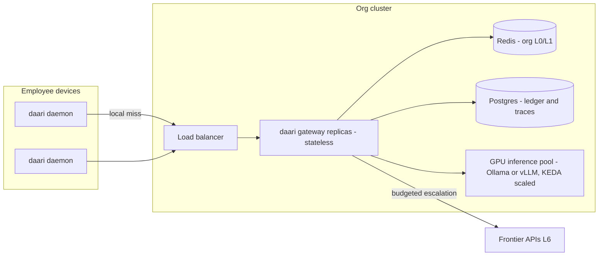

# daari — Roadmap v2: OSS launch, gateway parity, enterprise scale

> **Status:** Trains F1–F5 implemented (tracer-bullet depth for enterprise SSO/Postgres); PyPI upload remains user-gated — see [TRACKING.md](../TRACKING.md)
> **Last updated:** 2026-07-24
> **Inputs:** docs audit (2026-07-23) + competitive research: LiteLLM, Portkey, Bifrost, OpenRouter, Helicone, llmux, sarmakska/local-llm-router, Isartor K8s deployment patterns
> **Tracking:** GitHub issues labeled `auto-dev`; progress in [TRACKING.md](../TRACKING.md)

## Where daari stands (v1.2.0)

Shipped: tiered local-first routing (L0/L1 caches → L2 rules → Lt tools → L3–L5 local → L6 frontier), prompt intelligence + traces + savings ledger, cache-trust measurement (false-hit rate — no competitor publishes this), on-device learning (feedback → tuner → fine-tune → deploy), one-click clients (Cursor, Claude Code, JetBrains via Ollama facade, VS Code), MLX backend, per-project profiles, gateway API-key auth, org shared cache tracer bullet.

Differentiators to protect: **local-first privacy**, **measured cache trust**, **personal learning loop**, **client one-click setup**. Gaps below are what competitors have that we lack, plus what an OSS release and a company-wide deployment require.

## Competitive summary (2026-07)

| Product | Model | What they win on | What daari lacks vs them |
|---|---|---|---|
| LiteLLM (MIT, 22k+ stars) | Self-hosted proxy | 100+ providers, virtual keys, per-key budgets, community | Virtual keys, provider breadth, Prometheus story |
| Portkey (gateway OSS, hosted platform) | Managed gateway | Guardrails, built-in semantic cache, observability suite | Guardrails, polished observability |
| Bifrost (OSS, Go) | Self-hosted gateway | 11µs overhead, LLM+MCP+agents gateway in one, clustering, RBAC, web config UI | MCP egress, clustering/HA, config UI |
| OpenRouter | Hosted marketplace | 400+ models, one key, :nitro/:floor routing variants | Nothing structural (different model) — but L6 could route *through* it |
| llmux | Local-first proxy | Capability catalog (tools/json/vision), budget-pressure tier downgrade, weighted key rotation | Capability catalog, key rotation |
| sarmakska/local-llm-router | Local-first proxy | Responses API support, latency-budget cloud spill | Responses API |
| Isartor et al. (K8s pattern) | Enterprise deploy | Stateless gateway + Redis + GPU pool + HPA/KEDA | Everything (no Docker/k8s at all) |

## Train F1 — OSS launch readiness (adoption)

Goal: `docker compose up` or `pip install daari` to a working router in under 5 minutes; a docs site worth linking to.

| Feature | Notes |
|---|---|
| PyPI publication | Workflow exists but package never uploaded. Cut 1.2.x to PyPI (**user-gated**: needs PyPI token in repo secrets). `uvx daari serve` should work |
| `Dockerfile` + `docker-compose.yml` | Compose stack: daari + Ollama (+ optional org-cache). Image published to ghcr.io via Actions |
| Readiness/liveness probes | `/health` exists; add `/ready` (checks Ollama reachability + cache handles) for orchestrators |
| Docs site | MkDocs Material on GitHub Pages; migrate setup guides, PRDs, release notes |
| API reference | Generated from FastAPI OpenAPI schema (all `/v1/*`, Anthropic, Ollama facade, org-cache endpoints) |
| Config reference | Generated from pydantic `Settings` (every key, type, default, docstring) |
| Published benchmark | `scripts/bench.sh` results → docs page: local-vs-frontier cost/latency, cache hit rates, false-hit rate |
| CHANGELOG.md | Backfilled from RELEASE-v* notes; kept current per release |
| Homebrew formula | Tap with `brew install daari` (after PyPI) |

## Train F2 — Gateway parity (competitive feature gaps)

| Feature | Notes |
|---|---|
| OpenAI **Responses API** | `POST /v1/responses` adapter → InternalRequest; new OpenAI SDKs default to it |
| Multi-provider L6 + fallback chains | `frontier.providers: [...]` ordered list (openai, anthropic, openrouter, any OpenAI-compat base_url); per-provider circuit breaker (open after N failures, half-open probe); weighted API-key rotation per provider |
| Guardrails | Pre/post checks: input rules (regex deny/allow, max length, prompt-injection heuristics), output rules (PII echo, secret patterns); local-model judge optional; builds on `daari/gateway/pii.py`; every trip traced |
| Virtual keys | `daari keys create/revoke/list` → hashed keys in SQLite; per-key budgets (daily/monthly USD), rate limits (RPM), tier caps; extends `server.api_key` middleware + client-id ledger attribution |
| Capability catalog | Per-model capabilities (tools/json/vision/context) in config + auto-probe; router filters tiers by required capability (e.g. tools → skip models that can't) |
| VRAM-aware stack advisor | `daari doctor --suggest-models` reads system RAM/VRAM and recommends an L3/L4/L5 stack (llmux/local-llm-router pattern; extends `daari profile`) |

## Train F3 — Ops & observability

| Feature | Notes |
|---|---|
| Prometheus `/metrics` | Requests/tier, cache hit/miss, escalations, latency histograms, budget state, false-hit rate — no new hard dependency (hand-rolled exposition format or optional `prometheus-client`) |
| Grafana dashboard | JSON in `deploy/grafana/`; panels mirror the web UI |
| OTel export (optional) | Trace spans per request step (RequestTrace already has the data); off by default |
| Web UI config editor | Read current config, edit safe subset (routing, budgets, cache TTLs), write back via new authenticated endpoint; Bifrost pattern |
| Structured log option | JSON logs to stdout for container deployments (request log already JSON — unify) |

## Train F4 — Enterprise scale-out ("one install for every employee")

The deployment story when a company adopts daari fleet-wide. Two topologies, one codebase:

1. **Edge-heavy (default):** every laptop runs the daemon; org cluster provides shared cache + learning + an escalation gateway. Keeps inference on-device; the org cluster is small.
2. **Gateway-heavy:** thin clients point at org-cluster daari replicas; inference happens in a shared GPU pool (Ollama/vLLM). For fleets with weak laptops or VDI.

| Feature | Notes |
|---|---|
| Pluggable cache backend | `cache.backend: disk|redis` — L0/L1 (and org cache service) on Redis/Valkey so gateway replicas share state; diskcache stays the single-user default |
| Pluggable ledger/trace backend | `observability.backend: sqlite|postgres` — usage ledger, traces, feedback store; SQLite stays default |
| Stateless mode | With redis+postgres backends the daemon holds no request-scoped state → horizontal replicas behind any LB; in-memory metrics move to the metrics backend |
| Helm chart | `deploy/helm/daari/`: gateway Deployment + HPA (CPU/req-rate), Redis/Postgres as external refs, optional Ollama pool with KEDA queue-depth scaler notes; readiness probes from F1 |
| Org inference pool routing | Tier executors accept remote base URLs today (Ollama/MLX); add `routing.org_pool` (base_url + models) as an L5.5 between local tiers and L6 — device-local first, org pool second, frontier last |
| Fleet bootstrap | `daari enterprise bootstrap --org-config URL` — fetch signed org config (policies, budgets, cache URL, pool URL), install profile, register device; MDM-friendly (single command, idempotent) |
| Org policy sync | Periodic signed-config refresh (extends existing `org.learning_sync_seconds` sync loop); central tier caps, budget ceilings, guardrail rules |
| SSO/OIDC | Admin surfaces (web UI, org-cache admin, config editor) behind OIDC; per-employee virtual keys minted on first SSO login |
| RBAC + audit log | Roles: admin / analyst / user; append-only audit of config changes, key operations, budget overrides |
| Capacity guidance doc | Sizing table: requests/sec per gateway replica, Redis memory per 100k cache entries, GPU pool sizing per concurrent user |

## Train F5 — Old-roadmap leftovers

| Feature | Notes |
|---|---|
| Live-source providers (C1) | Open-Meteo + wttr.in + generic REST provider + `sources.yaml` priority config ([sources-integration.md](sources-integration.md)); completes Lt-fetch beyond the URL-fetch tracer |
| MCP egress client | daari calls external/corp MCP servers as tools ([integrations.md](integrations.md)); pairs with the existing MCP ingress |
| Phase B exit metrics | Run the eval suite, measure and record "$0-tier rate" and routing accuracy in TRACKING (roadmap v1 exit criteria never formally measured) |
| D4 defaults pipeline | When D3 opt-in stats exist from real users: aggregate → publish improved routing defaults per release |

## Sequencing & priorities

| Priority | Items | Why first |
|---|---|---|
| P1 | F1 Docker/compose/probes, CHANGELOG, PyPI prep; F3 Prometheus | Adoption blockers; everything else is invisible without an install story |
| P2 | F2 Responses API, guardrails, virtual keys, L6 fallback chains; F4 Redis backend + Helm | Competitive parity + first real scale-out step |
| P3 | F1 docs site + benchmark + Homebrew; F3 Grafana/OTel/config editor; F4 remainder; F5 | Polish, enterprise depth, leftovers |

Same loop contract as always: PRD → issues → TDD trains → 4 CI checks → auto-merge → live E2E → tracker update. User-gated: PyPI token, any paid infra, publishing the ghcr.io image (needs repo package permissions).

## Non-goals

- Hosted SaaS offering (stays self-hosted/local-first).
- Replacing corp IdP/MDM — integrate, don't rebuild.
- Model marketplace/billing (OpenRouter's lane; we can route L6 through it instead).
- Training foundation models (adapters only, per Phase D).

## Related docs

- [ROADMAP.md](ROADMAP.md) (v1, Phases A–E — shipped)
- [enterprise.md](enterprise.md) · [ADR-0014](../adr/0014-enterprise-distributed-org-learning.md)
- [trust.md](trust.md) · [learning.md](learning.md) · [intelligence.md](intelligence.md)
- [TRACKING.md](../TRACKING.md)
