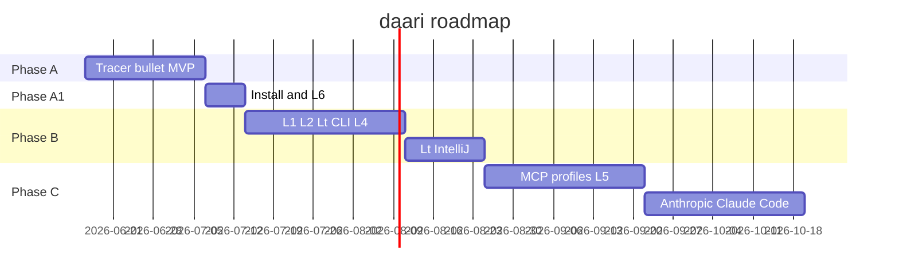

# daari — Product Roadmap

> **Status:** Draft — companion to [PRD v0.4](PRD.md)  
> **Last updated:** 2026-06-15  
> **Purpose:** Detailed phase plan — what ships when, which language, which clients

---

## Gateway adapter architecture

daari is **not tied to OpenAI's API shape**. Gateways are pluggable ([ADR-0007](../adr/0007-pluggable-gateway-adapters.md)):

```
Client → [Adapter: openai | anthropic | mcp | …] → InternalRequest
              → Router (L0–L6, Lt) → InternalResponse → Adapter → Client
```

| Phase | Adapters shipped |
|-------|------------------|
| A | `openai` only |
| C1 | `mcp`, optional `daari-native` |
| C2 | `anthropic` (Claude Code) |

Python module layout (Phase A must allow this):

```
daari/gateway/
  base.py       # GatewayAdapter protocol
  internal.py   # canonical request/response
  openai.py     # Phase A
  anthropic.py  # stub until C2
```

---

## Language strategy (overall)

| Layer | Language | Why | When |
|-------|----------|-----|------|
| **Core** (daemon, router, cache, CLI) | **Python 3.12** | FastAPI, routing, eval, Ollama — [ADR-0005](../adr/0005-python-tech-stack.md) | Phase A → B |
| **Install script** | **Bash** | `./install.sh` — venv, deps, Ollama pull | Phase A.1 |
| **Setup recipes** | **Python** (Typer) | Patch client configs; cross-platform logic | Phase A.1 → B |
| **Eval / tests** | **Python** (pytest) | Golden prompts, routing regression | Phase A → B |
| **Web UI** (optional) | **TypeScript** (future) | Dashboard for stats/cache — talks to localhost API | Phase C1+ |
| **IntelliJ plugin** (optional) | **Kotlin/Java** (future) | Native IDE integration if CLI insufficient | Phase C2+ |
| **MCP server** | **Python** (likely) | Reuse router modules | Phase C1 |

**Rule:** One Python **brain**. Other languages only for client-specific surfaces — never duplicate routing logic.

---

## Client support roadmap

| Client | Role | Wire format | Setup | Language (daari side) | Phase |
|--------|------|-------------|-------|----------------------|-------|
| **Cursor** | AI IDE client | OpenAI-compat | Manual doc → `daari setup cursor` | Python + bash | A → A.1 |
| **curl / scripts** | Testing | OpenAI-compat | None | — | A |
| **OpenAI SDK** (Python/TS) | Custom scripts | OpenAI-compat | `daari setup openai-compat` (env vars) | Python | B |
| **Claude Code** | CLI agent | Anthropic-compat *(needed)* | `daari setup claude-code` | Python gateway | C2 |
| **IntelliJ IDEA** | Lt backend (not AI client) | Subprocess / CLI | `daari setup intellij` | Python spawns IDE CLI | B.1 → C2 |
| **VS Code** | Lt backend (future) | CLI / extensions | `daari setup vscode` | Python | C2+ |
| **Generic UI** | Future dashboard | REST → daari API | N/A | TypeScript (UI only) | C1+ |
| **MCP agents** | Agent introspection | MCP protocol | Bundled in daemon | Python | C1 |

---

## Phase A — Tracer bullet MVP

**Duration:** ~2–3 weeks  
**Goal:** Prove cache + local model path works end-to-end  
**Language:** Python 3.12 only

### Ships

| Component | Tech | Details |
|-----------|------|---------|
| HTTP gateway | FastAPI + uvicorn | `POST /v1/chat/completions`, port `11435` |
| L0 exact cache | diskcache or SQLite | Hash(prompt + params) |
| Model executor | httpx → Ollama | Single model, e.g. `llama3.2:3b` |
| Router | Python heuristics | Logged; all requests → L3 unless L0 hit |
| CLI | Typer | `daari serve`, `daari stats` |
| Config | pydantic-settings | `~/.daari/config.yaml` |
| Eval | pytest + 10 prompts | From [routing-spec](routing-spec.md) GP-01–GP-10 |
| Docs | Markdown | [docs/setup/cursor.md](../setup/cursor.md) manual setup |

### Clients supported

| Client | Support level |
|--------|---------------|
| Cursor | ✅ Manual setup doc |
| curl / OpenAI SDK | ✅ base_url |
| Claude Code | ❌ |
| IntelliJ | ❌ |
| Agent tool_calls | ⚠️ Passthrough per ADR-0004; no L0 cache |

### Does NOT ship

- L1, L2, Lt, L4, L5, L6
- `daari setup`, `install.sh`, `daari doctor`
- Streaming (optional stretch — document if cut)

### Exit criteria

- [ ] Second identical prompt hits L0
- [ ] `daari stats` shows tier breakdown
- [ ] Cursor works via manual config
- [ ] 10 eval prompts pass

---

## Phase A.1 — Install & frontier fallback

**Duration:** ~1 week  
**Goal:** One-command install; quality fallback when local weak  
**Language:** Python + bash

### Ships

| Component | Tech |
|-----------|------|
| `install.sh` | bash — venv, pip install, Ollama model pull |
| `daari install` | Python Typer — same as script |
| `daari setup cursor` | Python — patch settings + backup |
| `daari setup --undo` | Python — restore backup |
| `daari doctor` | Python — health checks |
| L6 executor | httpx → OpenAI/Anthropic | Per ADR-0001 auto-escalate |
| Confidence scoring | Python | Per [routing-spec](routing-spec.md) |

### Clients supported

| Client | Support level |
|--------|---------------|
| Cursor | ✅ Automated setup |
| Claude Code | ❌ (still needs Anthropic gateway) |

### Exit criteria

- [ ] `./install.sh && daari doctor` passes
- [ ] `daari setup cursor --dry-run` shows diff
- [ ] Low-confidence local response escalates to L6 (if keys configured)

---

## Phase B — Full local-first stack (v1)

**Duration:** ~4–6 weeks  
**Goal:** Semantic cache, rules, Lt CLI tools, multi-model, multi-client setup  
**Language:** Python 3.12 (+ bash for any shell helpers)

### B.0 — Cache, rules, L2-dev, CCS, Lt CLI

| Component | Tech |
|-----------|------|
| L1 semantic cache | sqlite-vec + Ollama embeddings |
| L2 rules engine | Python regex/templates |
| **L2-dev** | Developer command patterns + `.daari/commands.yaml` |
| **CCS** | Command context store in `~/.daari/context/` |
| **Lt B.0** | Python subprocess → git, eslint, prettier, **shell from L2-dev** |
| L4 medium model | Second Ollama model (e.g. `llama3.1:8b`) |
| Hybrid classifier | Heuristics + optional SLM |
| `daari setup openai-compat` | Python — print/export env vars |
| Eval expansion | 20 prompts GP-01–GP-20 |

### B.1 — Lt IDE + confirmation

| Component | Tech |
|-----------|------|
| **Lt B.1** | Python subprocess → **IntelliJ** `idea` CLI |
| Destructive op gate | `X-Daari-Confirm-Tool` header |
| `daari setup intellij` | Python — register IDE path in config |

### Clients supported (end of Phase B)

| Client | Support | daari language | Notes |
|--------|---------|----------------|-------|
| Cursor | ✅ Full | Python setup | OpenAI-compat |
| OpenAI SDK | ✅ Full | Python setup | env vars |
| IntelliJ | ✅ Lt backend | Python spawns CLI | Not an AI client |
| Claude Code | ⚠️ Partial | — | Only if user forces OpenAI-compat mode |
| VS Code | ❌ | — | Phase C2 |

### Exit criteria

- [ ] `$0 tier rate` ≥30% on dev session eval
- [ ] Lt dispatches `git status` without model call
- [ ] Routing accuracy ≥90% on 20-prompt eval
- [ ] `daari setup --all` detects Cursor + Ollama

---

## Phase C1 — Agent & profiles (v2a)

**Duration:** ~3–4 weeks  
**Language:** Python (+ TypeScript if UI started)

| Component | Tech |
|-----------|------|
| L5 large local model | Ollama (e.g. `llama3.1:70b` q4 or best fit) |
| MCP server | Python (FastMCP or official SDK) |
| Per-project profiles | YAML in `.daari.yaml` per repo |
| Optional stats UI | TypeScript + React (separate package) — reads localhost API |

### Clients

| Client | New capability |
|--------|----------------|
| MCP agents | Query routing decisions natively |
| All OpenAI-compat | Per-project tier maps |

---

## Phase C2 — Client expansion (v2b)

**Duration:** ~3–4 weeks  
**Language:** Python gateway + optional Kotlin (IntelliJ plugin)

| Component | Tech | Language |
|-----------|------|----------|
| **Anthropic-compat gateway** | Second HTTP router | Python |
| `daari setup claude-code` | Config patch | Python |
| Richer IntelliJ registry | More refactor intents | Python CLI → **Kotlin plugin** if CLI insufficient |
| `daari setup vscode` | Lt via code CLI | Python |
| MLX backend (Apple) | Optional L3–L5 executor | Python bindings |

### Clients fully supported

| Client | Integration | Phase C2 |
|--------|-------------|----------|
| **Claude Code** | Anthropic-compat base URL | ✅ |
| **Cursor** | OpenAI-compat (existing) | ✅ |
| **IntelliJ** | Lt + optional plugin | ✅ |
| **VS Code** | Lt via CLI | ✅ |
| **Future UI** | TS dashboard | Optional |

---

## Visual timeline



---

## Tech stack by phase (summary table)

| Phase | Python | Bash | TypeScript | Java/Kotlin |
|-------|--------|------|------------|-------------|
| A | ✅ Core | — | — | — |
| A.1 | ✅ + setup | ✅ install.sh | — | — |
| B | ✅ + Lt subprocess | — | — | — |
| C1 | ✅ + MCP | — | ⚠️ UI optional | — |
| C2 | ✅ + Anthropic gateway | — | ⚠️ UI | ⚠️ IntelliJ plugin if needed |
| D | ✅ + ML feedback loop | — | — | Local fine-tune libs |

---

## Phase D — Local learning & collective improvement (future)

**Goal:** Each installation gets smarter locally; optional opt-in helps next release for everyone.

### D1 — Personal feedback loop (on-device)

| Component | Tech |
|-----------|------|
| Feedback capture | Python — user accepts/rejects response, tier override logs |
| Model picker | Python — recommend Ollama model per task type from local stats |
| Routing tuner | Python — adjust confidence thresholds from outcomes |

All data in `~/.daari/feedback/` — never leaves machine unless D3 opted in.

### D2 — Local fine-tuning (personal)

| Component | Tech |
|-----------|------|
| Fine-tune pipeline | Python + Ollama/MLX fine-tune tools |
| Training data | User corrections only — exported from local feedback store |
| Output | Personal adapter weights in `~/.daari/models/` |

**Not:** training a new foundation model. **Yes:** adapting a small local model to your workflow.

### D3 — Opt-in collective stats

| Component | Tech |
|-----------|------|
| Anonymized export | Python — tier success rates, latency percentiles, model IDs |
| Upload | Opt-in only; user reviews what leaves device |
| Content | **No** prompts/code by default |

### D4 — Better defaults next release

daari OSS project may publish improved routing defaults derived from aggregated opt-in stats (transparent, documented).

---

## Default models (recommended)

| Tier | Ollama model | Phase |
|------|--------------|-------|
| L3 SLM | `llama3.2:3b` | A |
| L4 medium | `llama3.1:8b` | B |
| Embeddings | `nomic-embed-text` | B |
| L5 large | `llama3.1:70b` (quantized) or best AS Mac fit | C1 |
| L6 frontier | User's OpenAI/Anthropic model | A.1 |

---

## Related docs

- [PRD v0.4](PRD.md)
- [routing-spec](routing-spec.md)
- [setup-spec](setup-spec.md)
- [Competitive landscape](../discovery/04-competitive-landscape.md)
